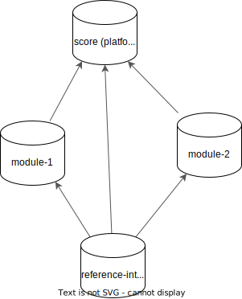

# Decision Record: Multi-Repository Documentation Setup in SCORE

## Problem Statement

The SCORE project manages stakeholder and feature requirements in the `/score`
repository (referred to as _platform_ hereafter). However, implementations and
implementation-specific requirements reside in separate repositories
(`/module-<xyz>`). These modules must link to the feature requirements they
implement. However, currently, linking is only possible within a single
repository.

## Decision

**Status**: Agreed

**Solution**: We'll use solution 2 (uni-directional linking). Details below.

Once implemented, we'll assess the feasibility of switching to bidirectional
linking, especially for the integration build. We'll probably use solution 1 or
3 in combination with the approach mentioned in 'Further Thoughts.' By that
time, we should have a clearer understanding of the problem and requirements.

## Context: Repository Dependencies and Setup

SCORE is structured as a multi-repository project.

### **score (_platform_)**

- The `score` repository hosts process requirements, process tooling
  (docs-as-code), and feature requirements.
- It is unaware of individual modules, as they are implemented in separate
  repositories, potentially outside of SCORE.

### **module-\<xyz\>**

- Each `module-<xyz>` repository contains module-level requirements derived
  from feature requirements, along with the module implementation.
- Modules must link to feature requirements in the _platform_ repository.

### **reference_integration**

- The `reference_integration` repository integrates a specific version of the
  platform and all required modules.
- Other integrations may exist, using different versions of the platform and
  modules.

## Requirements

- Links must remain correct and functional over time, at least for all released
  versions.
- Dependencies between repositories should work with any version, not just
  released versions, ensuring quick iterations and feedback loops.

## Use Cases

1. **Building platform documentation**
   - Includes process requirements, feature requirements, and guidance.
2. **Building documentation for a single module**
   - Includes module requirements, implementation, test results.
   - Potentially includes platform coverage metrics.
3. **Building documentation for an integration**
   - Includes platform requirements, all module documents, integration test
     results, and coverage metrics.

## Constraints

- All repositories follow the same process (version) and tooling (version).
- Custom Sphinx templates are only considered if provided centrally.
- Data protection is not a concern, as all content is open source under the
  same license.
- Requirements originating from integrations are out of scope.

## Previous Decisions

_Unfortunately, these are not documented, so we cannot provide links to past
decision records._

- SCORE handles multiple repositories via Bazel.
- Requirements and links are implemented using `sphinx-needs`.
- Requirement-link versioning is managed through hashes.
- We have two different mechanisms for versioning. The current assumption is
  that Bazel will pull other repositories in a specific version, while
  different versions of the same repository will not be pulled. Essentially,
  this follows the "classic multi-repo setup," similar to Git submodules.

## Bidirectional Linking Without Side Effects

"Bidirectional linking without side effects" means that the _platform_ website
remains unaffected by the modules while still linking to them. This
necessitates multiple versions of the platform website.

This can be avoided by maintaining a single platform website that either:
- Is aware of all module websites with bi-directional links, or
- Contains no module links at all (uni-directional links from module websites
  to the platform website).

### **Problems with Multiple Platform Websites**

- Maintaining multiple platform websites results in identical content with
  different module links.
- Users must be cautious about which variant of the platform website they view.

### **Benefits of Multiple Platform Websites**

- No need to host hundreds of platform website versions or artificially limit
  linking (e.g., only linking to tagged versions). Each module can host any
  version of the platform website.

#### **Multiple Platform Websites Model**

#### **Single Platform Website Model**

## Solutions

### **1. Bidirectional Linking Without Side Effects = Build from scratch**

Bazel imports dependencies from other repositories. When building module or
integration documentation, everything is built in a single pass.

#### **Pros:**

- Versioning is fully managed by Bazel with minimal overhead, as it is already
  used for source code.
- Supports untagged versions (any commit ID).

#### **Cons:**

- Heavy reliance on Bazel, potentially problematic for Esbonio and related
  tools.
- Performance issues, especially with Doxygen and test results, as everything
  is rebuilt each time.
- No reuse of previously built documentation via Bazel cache.

#### **Approach 1: Single Website**

- Uses Bazel to import dependencies.
- By producing a unified website is achieved by generating the root `index`
  file dynamically.
- **Pro:** Shared navigation menu and search functionality.
- **Con:** No customization via `conf.py`, limiting module-specific templates.

#### **Approach 2: Separate Websites**

- Uses Bazel to import dependencies.
- Generates individual websites for each repository using the
  `sphinx-external-needs` three-step process (build, exchange JSON, rebuild).
- Generates a landing page linking to each website.
- **Con:** No shared navigation menu or search functionality.

### **2. Uni-directional Linking + Website-based-versioning**

If we drop the bi-directional linking requirement, we can simplify the setup
significantly. The platform website will not link to modules, but modules will
link to the platform website.

For uni-directional linking and link validations, Bazel imports only
`needs.json` from other repositories (e.g., from the gh-pages branch, the
website, or release artifacts).

Potentially even better would be to simply depend on the docs:docs target of
the other repositories and fetch the needs.json from there. This should not be
a problem, as bazel should be able to cache the result.

#### **Pros:**

- Fast and efficient documentation builds.

#### **Cons:**

- Versioning is managed at the website level, not by Bazel.
- Verified linking is limited to versioned tags of repositories.
- Requires maintaining multiple website versions.

#### **Optimization:**

- Changes to the platform could trigger module builds which will validate
  whether the link hashes are still correct. This could be done by a CI job.
- We'll run link validation tests (hash comparisons) only for tagged versions
  or non-draft requirements. In the meantime e.g. the latest module-\<xyz\>
  version will point to the latest platform version without validation errors
  leading to build errors. This is a trade-off between turn-around-times and
  correctness.

  Link/hash errors lead to:
  * For tagged builds / for non-draft requirements: ERROR
  * Otherwise: WARNING

### **3. Uni-directional Linking + Bazel-based-versioning**

Similar to solution 2, but instead of linking to the original repository, we
copy the pre-rendered website from release artefacts or from the gh-pages
branch of that repository. This allows linking to the original website while
avoiding the need to build it ourselves. Versioning is fully managed by Bazel,
eliminating the need to maintain multiple website versions.

## Considered Alternatives

### **1. Needservice (Manual Approach)**

This is basically a manual approach to the problem. As long as any other
solution works, that would be preferrable.

### **2. Weblinks (Full URLs)**

We can simply link pages / needs in the other repositories by their full url.
While we can ensure that those links work, everything beyond that will become
problematic. Versioning might be solvable, but checking correct hashes
(versioning) is challenging. Other approaches are better suited for that.

Bidirectional links are not possible. As we'd like the same approach
everywhere, this is a **no-go**.

### **3. Needimport (Sphinx-Needs Extension)**

This is a sphinx-needs extension that allows to link to needs in other
repositories. The other repositories do NOT need to be available at build time.
Only their build output is required (needs.json).

Needs from the other repositories are imported, as if they were local. However
all structure is lost! All surrounding text, images etc are lost. Only the
needs themselfes are imported. This is a **no-go**.

### **4. Monorepo - No-Go**

- Violates SCORE’s fundamental design, which allows independent module
  development without modifying SCORE.

## Further Thoughts

If the platform dynamically generated back-links via JavaScript, a single
website could serve all modules using query parameters (e.g.,
`platform.html?module=module-xyz`). This approach could resolve usability
issues caused by having a single platform website and is a potential future
enhancement.

In case of multiple platform websites, we could use a different language like
Python to achieve the same result, without re-triggering Sphinx.
