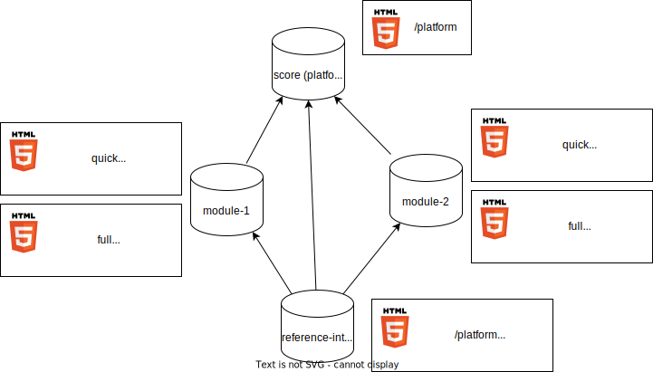

# Decision Record: multirepo docs setup in SCORE

## Problem Statement

Stakeholder requirements and features requirements of SCORE are in `/score`
repository (called _platform_ hereafter), while their implementations and
implementation-specific-requirements will be in `/module-<xyz>` repositories.
Those modules need to link requirements they are implementing. Currently
linking is only possible within a single repository.

## Decision

**Status**: Open, **Chosen solution**: -

## Context: Current/planned repository dependencies in detail

The project is set up as a multi-repository project.

#### score (_platform_)

The `score` repository contains process-requirements and process-tooling
(docs-as-code) as well as feature-requirements. We'll call it the _platform_.

The _platform_ is not aware of individual modules, as they are implemented in
separate repositories and potentially outside of SCORE.

#### module-\<xyz\>

Each `module-<xyz>` repository contains module-level-requirements, derived from
feature requirements. It also contains the module implementation.

As each module implements a subset of the feature requirements, it needs to
link to the feature requirements in the _platform_ repository.

#### reference_integration

The `reference_integration` brings everything together. It contains a reference
to a specific version of the platform and to all required modules.

Other integrations are possible, which will contain different versions of the
platform and different modules.

## Requirements

- links must remain correct and working over time, at least for all released
  versions.
- in general dependencies between repositories should be possible on any
  version, not only on released versions. That's the only way to ensure quick
  iterations and feedback loops.

## Use Cases

1. Build docs for _platform_
   - Content: process requirements, feature requirements, guidance, etc
2. Build docs for one module individually
   - Content: module requirements, implementation and test results, metrics for
     platform coverage
3. Build docs for an integration
   - Content: platform, all modules, metrics, integration test results

## Constraints

- For the sake of this decision we'll assume all repositories follow the same
  process (version) with the same tooling (version).
- Usage of custom sphinx templates is not accounted for. Only if they are
  provided centrally.
- Data protection is not necessary, since everything is open source under the
  same license.
- Requirements originating from the integration are not considered here.

## Previous Decisions:

_Unfortunately those are not documented, therefore we cannot provide links to
any decision records._

- In SCORE different repositories are handled by bazel.
- In SCORE requirements and links are implemented via `sphinx-needs`.
- In SCORE versioning of requirement-links is handled via hashes.
- We have two different mechanisms for versioning. Current assumption is that
  we'll use bazel to pull other repositories in a specific version, while we
  never pull different versions of the same repository. So basically, we have
  the "classic multi repo setup" situation, as it's well known from e.g. git
  submodules.

## Bidirectional linking without side effects

"Bidirectional linking without side effects" means that the _platform_ is not
affected by the modules, but it does provide links to the modules. This implies
that we need multiple versions of the platform.

Aka the following **independent** websites:

Which is great in theory, and does absolutely have its use cases. However, it
comes with a cost. And I'm talking about a cost to the end user. They need to
be super cautious which version of the platform they are looking at, since they
will look absolutely identical. The only difference is the links to the
modules.

This can be avoided by having a single website, which is aware of all the
modules. Or by having uni-directional links. Both cases would result in this
simplified setup:

### Solution for "Bidirectional linking without side effects"

We use bazel to "import" the other repositories. When building module-docs or
even integration-docs, everything is build in one go into one website. The top
level index.rst is generated on the fly, so it contains all links to the other
repositories.

Pro:

- Versioning is fully handled by bazel without any overhead, since it happens
  anyway for the source code.
- Full support for untagged versions (any commit id).

Con:

- Relies heavily on bazel -> potential problems with esbonio etc
- Very low performance, especially with e.g. doxygen and test results as this
  naive approach would build everything every time.

Approach 1 (single website):

- Use bazel to depend on the other repositories.
- Use links (ln) to create temporary links the other repositories inside the
  bazel- directories, so they appear to sphinx as if they were local files in
  the same repository.
- Con: No customizations via conf.py possible, e.g. module specific templates.

Apprach 2 (separate websites):

- Use bazel to depend on the other repositories.
- Generate individual websites for each repository with the usual
  sphinx-external-needs 3-step approach (build, exchange json, rebuild).
- Generate a landing page with links to the individual websites.
- Con: no common menu, no common search.

### Solution for "Non-Bidirectional linking or side effects"

As before We use bazel to "import" the other repositories, but only their
needs.json. Alternatively we grab the needs.json from the websites.

Pro:

- Full support for whatever the repositories are customizing.
- Very efficient / fast building of docs.

Con:

- Versioning is not handled by bazel, but on website level.
- Linking is limited to versioned tags of the other repository (e.g. tagged
  platform build).
- We need to keep a lot of versions of the websites around.

Possible optimization:

- Changes to the platform could trigger module builds which will validate
  whether the link hashes are still correct. This could be done by a CI job.

## Considered Alternatives

We'll start by exlusing some solutions quickly and then go into more detail
with the remaining ones.

### 1) needservice

This is basically a manual approach to the problem. As long as any other
solution works, that would be preferrable. Let's mark this one as a **no-go**.

### 2) weblinks

We can simply link pages / needs in the other repositories by their full url.
While we can ensure that those links work, everything beyond that will become
problematic. Versioning might be solvable, but checking correct hashes
(versioning) is challenging. Other approaches are better suited for that.

Bidirectional links are not possible. As we'd like the same approach
everywhere, this is a **no-go**.

### 3) needimport

This is a sphinx-needs extension that allows to link to needs in other
repositories. The other repositories do NOT need to be available at build time.
Only their build output is required (needs.json).

Needs from the other repositories are imported, as if they were local. However
all structure is lost! All surrounding text, images etc are lost. Only the
needs themselfes are imported. This is a **no-go**.

### 4) Monorepo

This violates the basic assumption of the project, which is to enable anyone to
implement a module without having to touch SCORE. **no-go**.

## Further thoughts

If the platform were able to generate back links on the fly via JavaScript, we
could have a single platform website with a parameter to the respective module.
e.g. platform.html?module=module-xyz

This seems simple enough and avoid the usability pitfalls of the many websites.

This could be a viable improvement for the future, if we start with uni-
directional links.
