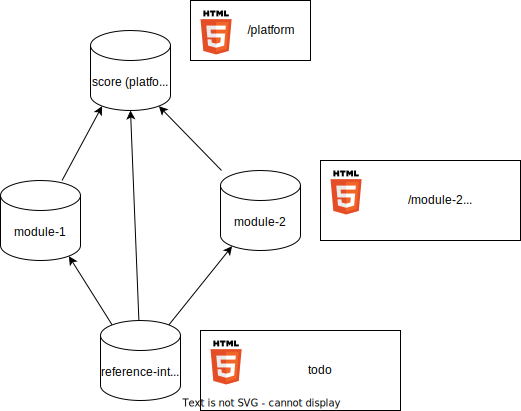

# Decision Record: multirepo docs setup in SCORE

## Problem Statement

Stakeholder requirements and features requirements of SCORE are in `/score`
repository (called *platform* hereafter), while their implementations and
implementation-specific-requirements will be in `/module-<xyz>` repositories.
Those modules need to link requirements they are implementing. Currently
linking is only possible within a single repository.

## Decision

**Status**: Open, **Chosen solution**: -

## Context: Current/planned repository dependencies in detail

The project is set up as a multi-repository project.

#### score (*platform*)
The `score` repository contains process-requirements and process-tooling
(docs-as-code) as well as feature-requirements. We'll call it the *platform*.

The *platform* is not aware of individual modules, as they are implemented in
separate repositories and potentially outside of SCORE.

#### module-\<xyz\>
Each `module-<xyz>` repository contains module-level-requirements, derived from
feature requirements. It also contains the module implementation.

As each module implements a subset of the feature requirements, it needs to
link to the feature requirements in the *platform* repository.

#### reference_integration
The `reference_integration` brings everything together. It contains a reference
to a specific version of the platform and to all required modules.

Other integrations are possible, which will contain different versions of the
platform and different modules.

## Requirements
* links must remain correct and working over time, at least for all released
  versions.
* in general dependencies between repositories should be possible on any
  version, not only on released versions. That's the only way to ensure quick
  iterations and feedback loops.

## Use Cases
1) Build docs for *platform*
   - Content: process requirements, feature requirements, guidance, etc
   - Traceability: no links to other repositories
2) Build docs for one module individually (quick)
   - Content: module requirements, module implementation
   - Traceability: no links to other repositories
3) Build docs for one module individually (full)
   - Content: module requirements, module implementation, feature-requirements
     coverage
   - Traceability: bidirectional links to *platform*. This implies that the
     *platform* is re-built as well, this time with links to the module.
4) Build docs for Reference integration
   - Content: platform, all modules, metrics
   - Traceability: bidirectional links between *platform* and all modules. This
     implies that all docs are re-built, this time with links to each other.

Some derivations of these types are possible as well, e.g. building one module
with unidirectional links to the *platform*.

### Bidirectional linking
Bidirectional linking without side effects leads to the following
**independent** websites:

## Constraints

* For the sake of this decision we'll assume all repositories follow the same
  process (version) with the same tooling (version).
* Usage of custom sphinx templates is not accounted for. Only if they are
  provided centrally.
* Data protection is not necessary, since everything is open source under the
  same license.
* Requirements originating from the integration are not considered here.

## Previous Decisions:

*Unfortunately those are not documented, therefore we cannot provide links to
any decision records.*
* In SCORE different repositories are handled by bazel.
* In SCORE requirements and links are implemented via `sphinx-needs`.
* In SCORE versioning of requirement-links is handled via hashes.
* We have two different mechanisms for versioning. Current assumption is that
  we'll use bazel to pull other repositories in a specific version, while we
  never pull different versions of the same repository. So basically, we have
  the "classic multi repo setup" situation, as it's well known from e.g. git
  submodules.

## Alternatives

We'll start by eclusing some solutions, then we look into some more promising
ones, and in the end we list some more extreme ideas.

### 1) needservice

This is basically a manual approach to the problem. As long as any other
solution works, that would be preferrable. Let's mark this one as a **no-go**.

### 2) weblinks

We can simply link pages / needs in the other repositories by their full url.
While we can ensure that those links work, everything beyond that will become
problematic. Versioning might be solvable, but checking correct hashes
(versioning) is challenging.

Bidirectional links are not possible. As we'd like the same approach
everywhere, this is a **no-go**.

### 3) needimport

This is a sphinx-needs extension that allows to link to needs in other
repositories. The other repositories do NOT need to be available at build time.
Only their build output is required (needs.json).

Needs from the other repositories are imported, as if they were local. However
all structure is lost! All surrounding text, images etc are lost. Only the
needs themselfes are imported. This is a **no-go**.

### 4) Copying rst

We use bazel to "import" the other repositories. When building a module or even
an integration, everything is build in one go, into one website. The top level
index.rst is generated on the fly, so it contains all links to the other
repositories.

Pro:
* Everything in one website.
* Versioning is fully handled by bazel without any overhead, since it happens
  anyway for the source code.

Con:
* Relies heavily on bazel -> potential problems with esbonio etc
* Performance / runtime, especially with e.g. doxygen as this naive approach
  would build everything every time.

!!! TODO: explain doxygen, test results, etc. !!!

Approach in detail (initial idea):
* Use bazel to depend on the other repositories.
* Use links (ln) to create temporary links the other repositories inside the
  bazel- directories, so they appear to sphinx as if they were local files in
  the same repository.

Possible optimization:
* In detail this approach might enable more efficient building, if we can keep
  all intermediate files of building a repository.

### 5) Copying json: Needs-external-needs (+ intersphinx)

As in 4) We use bazel to "import" the other repositories, especially their
needs.json. Each repository is build individually, with all needs.json files.
So we generate one website per repository, and link to the other websites. The
output looks as described in bidirectional linking. A landing page could be
generated in addition, to link to the generated websites.

Pro:
* Full support for whatever the repositories are customizing.
* In detail this approach might enable more efficient building, if we can keep
  all intermediate files of building a repository. As only additional
  needs.json files are added and the rest is re-used.

Con:
* Same as 4)

Possible optimization:
* In detail this approach might enable very efficient building, if we can keep
  all intermediate files of building a repository. As only additional
  needs.json files are added and the rest is re-used.

### 6) Monorepo

This violates the basic assumption of the project, which is to enable anyone to
implement a module without having to touch SCORE. **no-go**.

### 7) Link top-down

TODO: write up. How does it help? It's basically again, just a removal of a
constraint.

### 8) Unidirectional links

Having only unidirectional links enables a much simpler setup.

