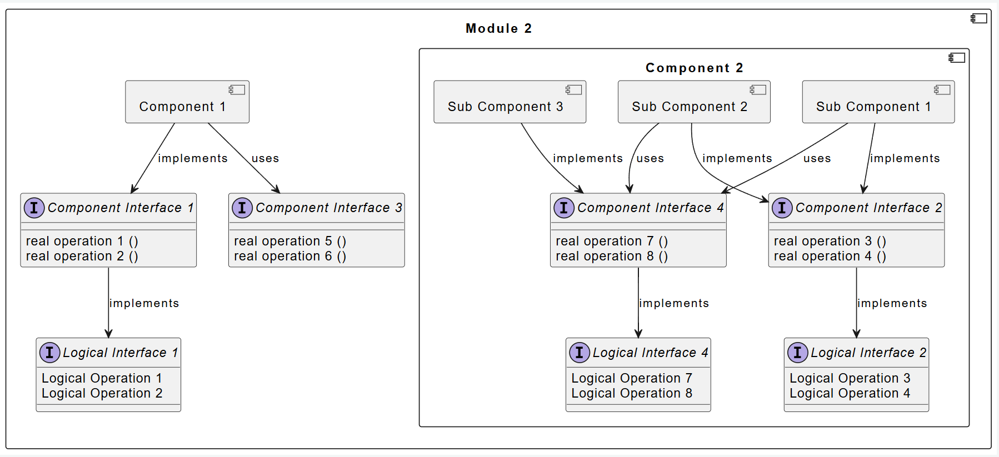
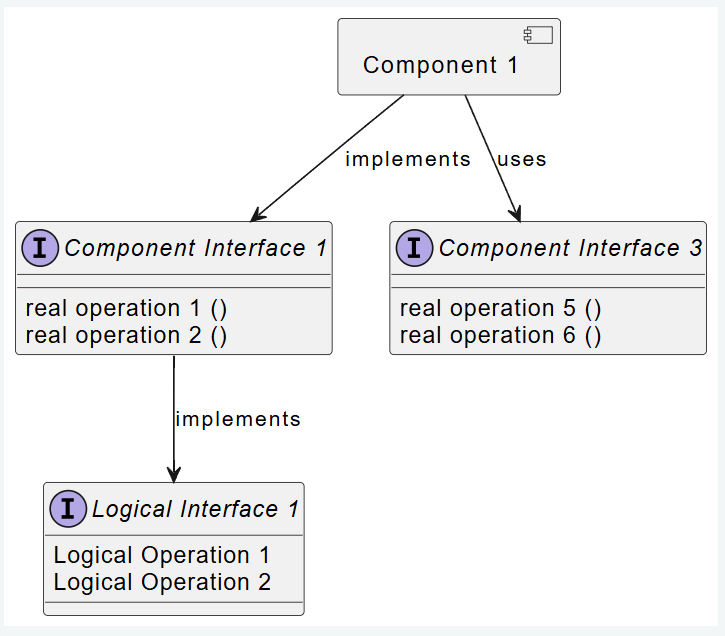
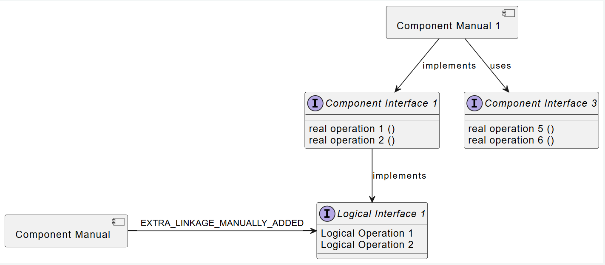

# UML Diagram Generation for Sphinx-Needs

## Overview

The system provides utilities to generate UML diagrams from requirement specifications. It supports various component types including:
- Components
- Component Interfaces
- Logical Interfaces
- Modules
- Features

as well as linkages between them.

## Usage

To generate a UML diagram, use the `needarch` directive in your Sphinx-Needs documentation:

```rst
.. needarch:
   :scale: 50
   :align: center

   {{ draw_feature(need(), needs) }}
```
You can add any layout or additional configuration you want before you call the `draw_xyz`.  

>It's also possible to manually extend the drawing. For an example, check out the [Manual Example](#manual-addition-to-the-uml)

## Available Drawing Classes

```bash
# Draw Feature
# Generates a UML representation of a feature and its included components/interfaces.

{{ draw_feature(need(), needs) }}

# Draw Logical Interface 
# Renders a logical interface and its operations.

{{ draw_logical_interface(need(), needs) }}

# Draw Module 
# Renders a module containing multiple components.

{{ draw_module(need(), needs) }}

# Draw Component
# Creates a complete component diagram including internal structure and linkages.

{{ draw_component(need(), needs) }}

# Draw Component Interface
# Generates a component interface diagram with its operations and implementations.

{{ draw_component_interface(need(), needs)}} 
```
<br>

>Note: The above syntax is for the `..needarch` directive. It is also possible to use the `..needuml` directive.  
To achieve this the `need()` call needs to be replaced with the following, as `..needuml` does not support `need()`.  
For a complete example see [here](#manual-addition-to-the-uml)
```bash
# need() => needs.__getitem__('ID OF THE REQUIREMENT YOU ARE IN')

# For example, drawing the requirement: `COMP_ARC_STA__component_manual_1` would then look as such
{{ draw_component( needs.__getitem__('COMP_ARC_STA__component_manual_1'), needs ) }}  
```

### Rendered Examples

Here are some excerpts of UML diagrams made from the requirements of that file.

#### **Module**  
The rst / directive for this was: 
```rst
.. mod_arc_sta:: Module 1
   :id: MOD_ARC_STA__module_1
   :security: YES
   :safety: ASIL_B
   :status: valid
   :includes: COMP_ARC_STA__component_1

      .. needarch::
         :scale: 50
         :align: center

         allowmixing

         {{ draw_module( need(), needs ) }}

# ... other referenced requirements below
```
Which then gives us this rendered image:


#### **Component**   

Here the rst was: 
```rst
.. comp_arc_sta:: Component 1
   :id: COMP_ARC_STA__component_1
   :status: valid
   :safety: ASIL_B
   :security: NO
   :uses: COMP_ARC_INT__component_interface_3
   :implements: COMP_ARC_INT__component_interface_1

      .. needarch::
         :scale: 50
         :align: center

         allowmixing

         {{ draw_component( need(), needs ) }}

# ... other referenced requirements below
```


#### Manual Addition to the UML

We use a similar rst as above, just this time we use `needuml` and add some extra manual UML at the end.
To make `needuml` work we have to replace the `need()` call with a different function call. 
> `needs.__getitem__('ID OF THE REQUIREMENT YOU ARE IN')`
```rst
.. comp_arc_sta:: Component Manual 1
   :id: COMP_ARC_STA__component_manual_1
   :status: valid
   :safety: ASIL_B
   :security: NO
   :uses: COMP_ARC_INT__component_interface_3
   :implements: COMP_ARC_INT__component_interface_1

   .. needuml::

     {{ draw_component( needs.__getitem__('COMP_ARC_STA__component_manual_1'), needs ) }}  

     component "Component Manual" as CM {
     }
     CM -> LI1: EXTRA_LINKAGE_MANUALLY_ADDED
```


---

## Limitations

- Grouping functionality needs improvement
- Manual extendability is limited to the same type as the underlying drawing, either class or association diagram types
- Currently only looks for the options `includes, uses, implements`
