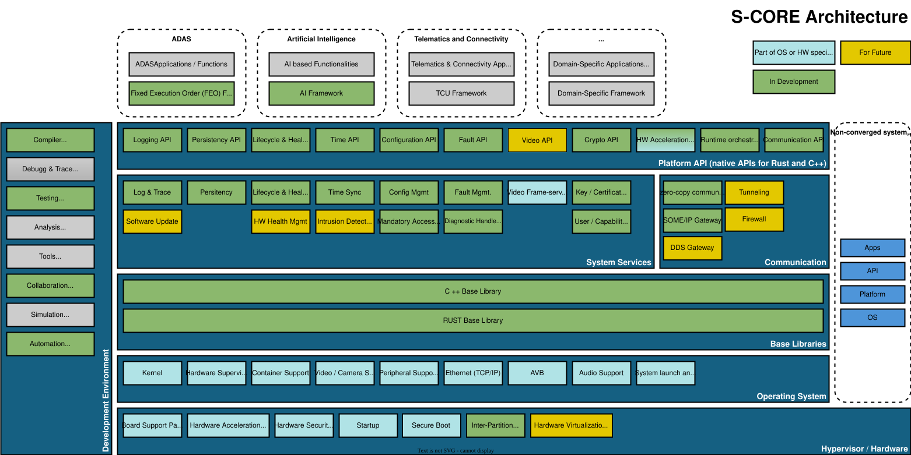

..
   # *******************************************************************************
   # Copyright (c) 2024 Contributors to the Eclipse Foundation
   #
   # See the NOTICE file(s) distributed with this work for additional
   # information regarding copyright ownership.
   #
   # This program and the accompanying materials are made available under the
   # terms of the Apache License Version 2.0 which is available at
   # https://www.apache.org/licenses/LICENSE-2.0
   #
   # SPDX-License-Identifier: Apache-2.0
   # *******************************************************************************

Platform Architecture
#####################

.. document:: Platform Architecture
   :id: doc__platform_architecture
   :status: valid
   :version: 1
   :safety: ASIL_B
   :security: YES
   :realizes: wp__platform_arch[version==1]

Platform Feature List
---------------------

.. needtable::
   :style: table
   :types: feat
   :columns: id;Security;Safety;status
   :filter:  id not in ["feat__example_feature", "feat__feature_name", "feat__feature_name_example"]
