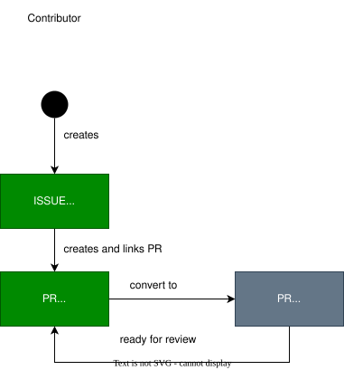

..
   # *******************************************************************************
   # Copyright (c) 2026 Contributors to the Eclipse Foundation
   #
   # See the NOTICE file(s) distributed with this work for additional
   # information regarding copyright ownership.
   #
   # This program and the accompanying materials are made available under the
   # terms of the Apache License Version 2.0 which is available at
   # https://www.apache.org/licenses/LICENSE-2.0
   #
   # SPDX-License-Identifier: Apache-2.0
   # *******************************************************************************

.. _issue:

Issue Guide
===========

.. document:: Issue Guide
   :id: doc__issue_guide
   :status: valid
   :version: 1
   :safety: QM
   :security: NO
   :realizes: wp__training_path[version==1]

A *GitHub Issue* is the way to report bugs or propose improvements without knowing the solution and to request features (incl. scope changes).

For creating *GitHub Issue* compare here:  `Creating a GitHub Issue (Github Docs) <https://docs.github.com/en/issues/tracking-your-work-with-issues/using-issues/creating-an-issue>`_.

Create an *GitHub Issue* to collect feedback, before investing too much effort into a *PR*. *GitHub Issues* may be accompanied by draft *PRs* if code is to be shown.

It can also be used to collect community input and for planning and tracking activities.

