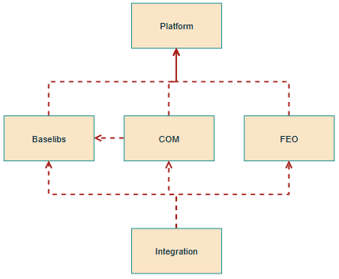
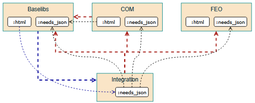

..
   Copyright (c) 2025 Contributors to the Eclipse Foundation

   See the NOTICE file(s) distributed with this work for additional
   information regarding copyright ownership.

   This program and the accompanying materials are made available under the
   terms of the Apache License Version 2.0 which is available at
   https://www.apache.org/licenses/LICENSE-2.0

   SPDX-License-Identifier: Apache-2.0

DR-004-Infra: Bi-directional traceability in docs
=================================================

.. dec_rec:: Bi-directional traceability in docs
   :id: dec_rec__infra__traceable_docs
   :status: accepted
   :context: Infrastructure
   :decision: Single integration documentation

   .. csv-table::
      :header: Criteria, Option S, Option M
      :widths: 20, 10, 10

      UX, 💚, 😡
      Speed, 😡, 💚
      Bureaucracy, 😡, 💚

   Since UX is more important than speed and bureaucracy, option S is best.

   Date: 2025-10-22

Context / Problem
-----------------

The S-CORE project adopted a multi-repo strategy.
Since `S-CORE aims for compliance with regulations like ASPICE <https://eclipse-score.github.io/process_description/main/standards/index.html#standards>`_,
bi-directional traceability is necessary (see :need:`gd_req__req_traceability`) and should be made convenient.
How to provide this in S-CORE documentation?

Previously, there was this unfinished
`Decision Record: Multi-Repository Documentation Setup in SCORE <https://github.com/AlexanderLanin/score/blob/docs-multirepo/docs/_tooling/decision-records/multirepo.md>`_.

For discussion, this subset of S-CORE modules shall serve as an example:

Goals and Requirements
^^^^^^^^^^^^^^^^^^^^^^

1. We want to enable each module to work independently and efficiently, i.e. build their own documentation quickly.
2. We want a complete and consistent documention for a release, i.e. everything with backlinks.
3. Some modules want backlinks even if the slows down the doc build.
   For example, platform wants backlinks for the feature requirements.
   Baselibs does not care about backlinks because they assume everybody anyways.

Module vs Target dependencies
^^^^^^^^^^^^^^^^^^^^^^^^^^^^^

To understand how backlinks do not imply circular dependencies we must understand the difference between module and target dependencies.

*If* Baselibs wants to see backlinks (i.e. COM references) in their documentation, they need to introduce the blue dependencies below:

There is a additional module dependency to the Integration module.
This is circular because Integration also uses the Baselibs module.
This just makes all their targets visible to each other.

There is an additional target dependency from @Baselibs:html to @Integration:needs_json which contains *all* needs-elements of the S-CORE project.
There is no circular dependency among target dependencies.
Bazel would show an error if you try.

Options Considered
------------------

Option S: Single integration documentation
^^^^^^^^^^^^^^^^^^^^^^^^^^^^^^^^^^^^^^^^^^^

Collect the documentation from all repositories and build a single huge html website.

A prototype is available in `a-zw/score_full-docs <https://github.com/a-zw/score_full-docs/tree/61205c616a99e395e0f63fb995bd828271433b44>`_.

Current implementation for external needs means modules reference external ids with a prefix.
This prefixed id does not exist in a mega-build which results in Sphinx warnings.

😡  Bureaucracy: Modules must not use prefixes for external needs because it breaks the integration build.
The docs-as-code repo must be refactored accordingly.

😡  Speed: This will result a long-running build step unsuitable for pull request in general.

💚  UX: While the integration documentation is huge, it has a unified configuration and navigation is consistent.

Option M: Module documentation rebuilt
^^^^^^^^^^^^^^^^^^^^^^^^^^^^^^^^^^^^^^

The documentation of a single module may be outdated with respect to external needs, i.e. backlinks.
Just imagine a new module is created which uses Baselibs but Baselibs makes no changes, so the documentation is never rebuilt.

This implies that the integration module must build all documentation themselves for a release.
While it might seem redundant if we already have the independent module's docs, this is necessary to ensure consistency.

Since modules might reference older versions of other modules, integration may be forced to override versions.
This is an additional reason for a rebuild.

💚  Bureaucracy: Modules decide about prefixes for themselves.

💚  Speed: This should build faster because we can rebuild modules in parallel.

😡  UX: Navigating between modules may be confusing since the navigation and whatnot changes.
