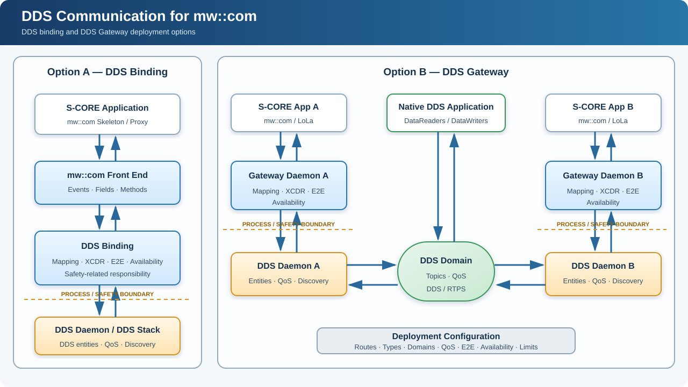

# DR-009-ddsgw: Introduce DDS communication for mw::com

- **Date:** 2026-09-17

```{dec_rec} Introduce DDS communication for mw::com
:id: dec_rec__arch__introduce_dds_communication
:status: accepted
:version: 1
:tracking: https://github.com/eclipse-score/score/issues/2726
:context: S-CORE lacks a common way for mw::com applications and services to use DDS data-centric communication or interoperate with native DDS systems.
:decision: Add DDS communication through a DDS binding beneath the mw::com front end and a deployable DDS Gateway for bridging existing mw::com services to DDS domains.
```

---

## Context / Problem

S-CORE applications use `mw::com` as their service-oriented communication API.
The LoLa binding provides high-performance shared-memory communication on the
same ECU, and SOME/IP support provides service-oriented communication across
networked ECUs.

DDS adds a different and complementary communication model. It is an
OMG-standardized, data-centric publish/subscribe technology designed for
distributed systems. DDS is relevant to S-CORE because it provides:

- Automatic discovery of publishers and subscribers.
- One-to-one, one-to-many, and many-to-many data distribution.
- Configurable Quality of Service for reliability, durability, history,
  deadline, liveliness, lifespan, ownership, and resource limits.
- Efficient distribution of high-rate and large data where supported by the
  selected DDS implementation and deployment.
- Late-joiner access to retained state through durability and history.
- Separation of communication environments through DDS domains.
- Standardized DDS-XTypes and XCDR1/XCDR2 data representations.

These capabilities make DDS suitable where several consumers need the same
data, different data streams require different delivery behavior, high-rate or
large data must be distributed, or a system must interoperate with DDS-native
components.

DDS does not replace LoLa or SOME/IP. LoLa remains appropriate for efficient
local shared-memory communication. SOME/IP remains appropriate where its
service-oriented protocol and ecosystem are required. DDS provides an
additional deployment choice for data-centric distributed communication.

S-CORE currently has no standardized DDS integration for `mw::com`. Without
one:

1. Applications must use DDS-specific APIs directly and lose the common
   `mw::com` front end.
2. Projects create incompatible adapters for mapping, types, serialization,
   discovery, QoS, E2E protection, and recovery.
3. Existing LoLa-based services cannot connect to DDS domains without a
   project-specific gateway.
4. Native DDS applications cannot expose their data through a consistent local
   `mw::com` service.
5. Safety-related application logic can become coupled to a DDS stack integrated
   as a QM component.

S-CORE therefore needs both:

1. A DDS communication binding underneath the `mw::com` front end for
   applications deployed directly with DDS communication.
2. A DDS Gateway for bridging existing `mw::com`/LoLa deployments with DDS
   domains and native DDS applications.

The originating feature material is available in:

- [DDS Gateway tracking issue #2726](https://github.com/eclipse-score/score/issues/2726)
- [DDS Gateway feature request PR #2997](https://github.com/eclipse-score/score/pull/2997)

This Decision Record establishes the feature and its architectural boundaries.
Detailed APIs, configuration schemas, IPC messages, concurrency, serialization
algorithms, and source-code structure belong to downstream requirements and
implementation-design documents.

## Decision

S-CORE shall add DDS communication for `mw::com` through two complementary
deployment options.

### Option A: DDS Gateway

A deployable DDS Gateway shall consume and provide existing `mw::com` services,
normally through LoLa, and bridge them to configured DDS domains.

This option is intended when:

- Existing `mw::com` applications shall remain unchanged.
- DDS is introduced at a deployment boundary.
- An `mw::com` service shall interoperate with a native DDS application.
- Two S-CORE systems shall exchange `mw::com` services over DDS.
- Routing between configured DDS domains is required.

### Option B: DDS binding beneath mw::com

An application shall continue to use the existing `mw::com` Skeleton and Proxy
interfaces. Deployment configuration shall select the DDS binding instead of,
or in addition to, another communication binding.

The DDS binding shall map configured `mw::com` service elements to DDS entities
and provide the required type transformation, availability mapping, DDS QoS,
and E2E handling.

This option is intended for applications whose configured communication path is
DDS while retaining the common `mw::com` application API.

Both options shall use common architectural principles for service mapping,
type descriptions, serialized DDS data, QoS, availability, E2E protection,
safety separation, and DDS implementation independence.

### Logical architecture



For gateway-to-gateway communication, the complete path is:

```text
S-CORE App A ↔ mw::com/LoLa ↔ Gateway A ↔ DDS Daemon A
             ↔ DDS Domain ↔ DDS Daemon B ↔ Gateway B
             ↔ mw::com/LoLa ↔ S-CORE App B
```

A native DDS application participates directly in the DDS domain and does not
require an S-CORE Gateway Daemon.

### Common service mapping

Both deployment options shall support bidirectional mapping.

| `mw::com` concept | DDS communication responsibility |
|---|---|
| Event | Map publication and subscription to configured DDS data communication |
| Field | Preserve notification, current-value, getter, setter, and error semantics |
| Method | Preserve request, response, error, timeout, and correlation semantics |
| Service instance | Map provider, service, and instance identity |
| Offer/StopOffer | Propagate service availability or unavailability |
| Proxy discovery | Report availability only when configured DDS conditions are satisfied |

The downstream interface specification shall define exact DDS entities, Topic
naming, request/response correlation, and message formats.

### Configuration

Deployment configuration shall define:

- Selected integration option and communication direction.
- `mw::com` service and service-element identifiers.
- DDS Domain ID, Topic name, and type name.
- DDS type description and XCDR representation.
- DDS QoS.
- `mw::com` Quality Type and DDS-domain mapping.
- Explicit or endpoint-based availability.
- E2E configuration.
- Type, sample, entity, instance, and route limits.

Only configured routes shall be active. Discovery of an arbitrary DDS Topic
shall not automatically create a route.

### DDS types and serialized data

Applications shall not be required to include DDS-vendor-specific or
IDL-generated APIs. Type descriptions shall be supplied as deployment input or
generated artifacts and used to create DDS Dynamic Types or equivalent runtime
types.

The DDS binding or Gateway Daemon shall transform native `mw::com` data to and
from the configured XCDR1 or XCDR2 representation. Native C++ padding shall not
be transferred as DDS application data.

The type model shall support the constructs required by the mapped interfaces,
including DDS keys and RTPS KeyHash calculation.

Serialized payloads shall be given to the DDS integration through a serialized-
data interface. DDS discovery, matching, history, reliability, liveliness,
instance management, and network transport remain DDS stack responsibilities.

### DDS QoS and data rates

Deployment configuration shall expose the DDS QoS required by a route,
including reliability, durability, history, resource limits, deadline,
liveliness, lifespan, ownership, destination order, partition, and data
representation.

The DDS stack shall evaluate compatibility and perform the configured DDS
behavior.

The design shall support different payload sizes and rates, including high-rate
and large-data communication when supported by the selected DDS stack and
deployment. It shall avoid unnecessary transformations and copies and permit
zero-copy optimization where all interfaces support it.

The feature does not define an additional gateway-owned worker pool, QoS-lane
scheduler, or per-route queue. Buffering and delivery behavior are provided by
the applicable `mw::com`/SoCom, IPC, and DDS mechanisms.

### Availability

Cooperating gateways shall exchange explicit service-instance state through a
keyed DDS administration Topic. The identity shall distinguish provider,
service, and instance. QoS shall retain the current state per configured
instance.

For native DDS applications without explicit service state, availability may be
derived from configured endpoint matching and liveliness. All mandatory
endpoints shall be available before the corresponding local `mw::com` service
is offered.

### Safety, E2E, and recovery

The architecture shall permit the DDS stack and DDS Communication Daemon to
remain QM while safety-related mapping, E2E processing, and availability control
remain on the safety-related side.

Where required, E2E protection shall be generated or validated above the DDS
integration interface. DDS reliability does not replace safety E2E protection.

The feature shall reconcile complete configured and observed state after a
Gateway Daemon, DDS Communication Daemon, DDS participant, IPC connection, or
remote endpoint restarts. Stale DDS-derived services shall not remain offered.

### DDS implementation independence

A reference implementation may use Eclipse Cyclone DDS. Vendor-specific APIs
shall remain contained in the DDS integration. Another suitable DDS stack shall
be integrable without changing the `mw::com` application interface or the
behavior established by this decision.

### Limitations and out of scope

DDS content-filtered Topics and gateway-configured content filtering are not
part of this decision. Filtering inside the QM DDS integration would decide
which application samples cross toward the safety-related component. The
required semantics, safety responsibility, configuration authority, and failure
behavior have not been defined.

Samples received for a configured active route shall be forwarded subject to
configured DDS QoS and resource limits. Application-level sample selection
remains outside DDS content filtering. Adding DDS content filtering requires a
follow-up architectural decision.

Also outside scope are:

- Automatic bridging of arbitrary discovered Topics.
- Selection of a mandatory DDS vendor.
- Internal classes, threads, and IPC wire formats.
- Implementation phases or delivery order.

## Backwards Compatibility

The feature is use-case dependent. Existing `mw::com`, LoLa, and SOME/IP applications and
deployments require no changes unless DDS communication is selected.

No stable `mw::com` application API is removed. Any later breaking API change
shall follow the Breaking Change FEP process.

## Alternatives Considered

### Use DDS APIs directly in applications

Applications could use DDS APIs directly, including their type, discovery,
QoS, and lifecycle interfaces.

However, this would introduce DDS-specific dependencies into application code
and require each project to define its own integration with `mw::com` services.

This alternative is not selected because the proposal preserves `mw::com`
as the common application-facing interface. Native DDS applications remain
supported as communication peers.

### Integrate the QM DDS stack into safety-related processes

This simplifies deployment and avoids IPC between safety-related processing
and the DDS stack.

However, it places the QM DDS stack in the same address space as safety-related
processing, increasing the scope of fault-containment and interference concerns.

This alternative is not selected as the reference safety architecture.
The selected approach separates the DDS stack from safety-related communication
processing through a defined process and interface boundary.

### Require DDS-generated type support and serialization

The integration could use IDL-generated DDS interfaces and their associated
DDS-provided serialization and deserialization support.

This provides compile-time interfaces and reuses the DDS implementation's
type support. However, it introduces dependencies on deployment-specific
generated artifacts and vendor-specific serialization support.

Where generated artifacts participate in safety-related processing, their
verification and the required confidence in the generation tools must be
addressed. Depending on tool usage and output-verification measures, this may
require tool qualification or additional verification evidence.

Delegating application-data transformation to the QM DDS daemon would also
place that responsibility outside the intended safety-related boundary.

This alternative is not selected as the required integration model.
The selected approach keeps application-data transformation in the Gateway
or DDS binding and passes serialized payloads to the DDS integration.

IDL and generated type-description artifacts remain permitted as configuration
inputs, provided their correctness is established.

### Rely entirely on DDS discovery for service availability

DDS discovery could be used directly as the source of availability exposed
to `mw::com` applications.

However, discovering compatible communication endpoints does not necessarily
mean that the corresponding application service is ready or offered.
DDS discovery and `mw::com` service availability therefore cannot always
be treated as equivalent.

This alternative is not selected as the complete availability model.
The integration must preserve `mw::com` service availability while also
supporting native DDS applications. The detailed mapping shall be defined
in the downstream architecture.


## Rationale

The selected approach integrates DDS through the common `mw::com` interface
while preserving service behavior, deployment flexibility, and the required
safety boundary.

### Preserve the application interface

Applications continue to use `mw::com` Skeletons and Proxies.
DDS-specific types, Topics, Domains, QoS, and discovery configuration remain
within the communication integration and deployment configuration.

This avoids repeating DDS integration logic in applications and limits
their dependency on a particular DDS implementation.

### Preserve service semantics

The integration provides a common mapping for `mw::com` events, fields,
methods, and service-instance availability.

This is necessary because DDS communication entities do not directly represent
all `mw::com` service semantics. A shared contract prevents projects from
introducing incompatible behavior across the DDS boundary.

Availability handling must account for both cooperating S-CORE integrations
and native DDS peers without requiring every native DDS application to
implement an S-CORE-specific service-state protocol.

### Separate safety-related processing from the QM DDS stack

The architecture allows the DDS stack to remain QM while safety-related
transformation, E2E processing, and availability control remain above the
DDS integration boundary.

Process separation supports fault containment, independent supervision,
and recovery. The downstream safety analysis must additionally address
IPC behavior, resource interference, and failure propagation.

### Keep application-data transformation under S-CORE control

The Gateway or DDS binding transforms between native `mw::com` data and
the configured DDS representation. The DDS integration handles the resulting
serialized application payloads.

This keeps transformation behavior and its verification within the
safety-related communication component, without requiring deployment-specific
DDS-generated executable type support.

The serializer, deserializer, type descriptions, and any tools generating those
descriptions still require the applicable validation, verification, and
tool-confidence measures.

### Enable configurable and reusable integration

Deployment-provided type descriptions and route configuration allow the
integration to support different service interfaces without embedding their
DDS details in application code.

Containing vendor-specific APIs within the DDS integration permits another
suitable DDS stack to be used while preserving the application-facing contract.

### Reuse DDS middleware functionality

Discovery, endpoint matching, reliability, history, liveliness, and transport
remain responsibilities of the DDS stack.

S-CORE provides the service adaptation, data transformation, E2E processing,
and availability mapping required by `mw::com`. This avoids duplicating DDS
middleware functionality while establishing consistent integration behavior.

## Consequences

Acceptance establishes DDS communication as an additional S-CORE capability and
approves both architectural options. Implementation remains tracked separately
during Phase 4 of the FEP process.

| Work product | Required follow-up |
|---|---|
| Feature description | Align PR #2997 with this decision |
| Requirements | Define verifiable binding and gateway behavior |
| Logical architecture | Detail both deployment options and safety boundaries |
| Interfaces | Define binding, IPC, serialized-data, and DDS contracts |
| Service mapping | Define event, field, and method mappings |
| Configuration | Define routes, types, Domains, Topics, QoS, E2E, availability, and limits |
| Discovery and lifecycle | Define availability, failure, restart, and reconciliation |
| Safety and security | Analyze the QM boundary, E2E, interference, and allowed routes |
| Verification | Cover interoperability, QoS, data rates, recovery, and fault injection |

If implementation reveals that this accepted architecture must materially
change, it shall be handled through an amendment or follow-up FEP rather than
silent implementation divergence.

## Rejected Ideas

No additional idea has yet been formally rejected during the Final Comment
Period. This section shall be updated when an alternative is explicitly
rejected during FCP.
