<!--
Copyright (c) 2026 Contributors to the Eclipse Foundation

See the NOTICE file(s) distributed with this work for additional
information regarding copyright ownership.

This program and the accompanying materials are made available under the
terms of the Apache License Version 2.0 which is available at
https://www.apache.org/licenses/LICENSE-2.0

SPDX-License-Identifier: Apache-2.0
-->

# DR-009-Infra: Harmonizing the `dependable_element` concept with the sphinx-needs based S-CORE process

* **Date:** 2026-07-17

```{dec_rec} Harmonizing dependable_element with the sphinx-needs S-CORE process
:id: dec_rec__infra__dep_elem_harmonization
:status: proposed
:context: Infrastructure
:decision: Extend the existing sphinx-needs toolchain with dependable_element as the aggregation and traceability layer, fed from a single needs.json source of truth
```

---
## Executive Summary

S-CORE currently documents its process artifacts — stakeholder, feature and
component requirements, architecture, assumptions of use, safety analyses,
checklists — as **Sphinx-Needs** directives (`.. feat_req::`, `.. comp_req::`,
…) inside `.rst`/`.md` sources. The build emits a project-wide `needs.json`,
which serves two purposes: it is used both to **check that the need elements
conform to the metamodel** (e.g. mandatory attributes, allowed types and link
targets) and to **verify traceability** — both checks being performed by
sphinx / sphinx-needs on the basis of `needs.json`.

In parallel, a newer set of Bazel rules (`rules_score`) introduces the
**`dependable_element`** concept: a macro that aggregates all safety-relevant
artifacts of a *Safety Element out of Context (SEooC)* into one deliverable —
requirements, architectural design, assumptions of use, dependability
analysis, components, tests, checklists and glossary — and produces both a
consolidated LOBSTER traceability report and a self-contained Sphinx HTML
documentation for that element.

Today these two worlds overlap but are not formally reconciled: the process
description assumes a "flat" sphinx-needs documentation, while
`dependable_element` imposes a typed, per-element aggregation model. This DR
proposes to **harmonize** them so that `dependable_element` becomes the
*aggregation and traceability layer on top of* the existing sphinx-needs
toolchain, rather than a competing parallel mechanism.

### Proposed Approach

- Keep **sphinx-needs `needs.json` as the single source of truth** for all
  requirement-relevant needs. Authors continue to write `.. feat_req::` /
  `.. comp_req::` / `.. aou_req::` directives in their normal doc sources.
- Extend **`dependable_element`** to accept the module's `.rst` files directly
  as input arguments, extract the necessary need elements (requirements and
  assumptions of use) from them, and convert those to TRLC on the fly. As a
  side benefit, the generated files are then also checked against the TRLC
  metamodel, adding a second, independent validation layer on top of the
  sphinx-needs metamodel check.
- Let **`dependable_element`** consume the resulting typed artifacts to build
  the per-element LOBSTER traceability report and the aggregated HTML docs.
- Align the **process description** (S-CORE process) so the required artifacts
  and their tracing tiers map 1:1 onto the `dependable_element` inputs.

---
## Context / Problem

The implementation and automation of the S-CORE process with the
sphinx / sphinx-needs toolchain already provides a solid foundation that makes
it possible to roll the process out to modules. Today a module can adopt the
process, author its work products and obtain automated traceability without
building the tooling from scratch. In particular, the current sphinx /
sphinx-needs integration already does several things very well:

- authoring of process work products (requirements, architecture, assumptions
  of use, …) as lightweight, human-readable directives directly next to the
  documentation
- a single, project-wide `needs.json` as a machine-readable representation of
  all need elements
- automated **metamodel conformance checks** (mandatory attributes, allowed
  types and link targets) on that `needs.json`
- automated **traceability verification** across the linked need elements
- rendering of a complete, navigable HTML documentation with cross-references
  and back-links between the need elements

However, this foundation is not without weaknesses. Some of the current
technical solutions exhibit **instability**, and the overall **degree of
automation can still be increased significantly**:

- support for detailed design is completely missing
- consistency checks between component and detailed design diagrams versus the
  real dependencies in the build system and the structure in the source code
  are missing
- any kind of dependencies between tests / test executions and the generated
  test reports in sphinx-needs are missing
- sphinx / sphinx-needs does not allow, at least the way it is set up right
  now, to specify accurate dependencies between requirements ↔ architecture ↔
  source code ↔ tests. It treats everything as one big folder, where every
  change forces everything to be regenerated
- the framework that most of the current process automation is built on —
  **sphinx and sphinx-needs** — **cannot be properly qualified** for use in a
  safety-critical context. It is a large, dynamically extensible documentation
  toolchain that was not designed with tool qualification in mind: its
  behaviour depends on a broad set of third-party Python extensions and
  configuration that can change the output in ways that are difficult to
  constrain and reproduce, and the validation logic (both the metamodel and
  the traceability checks) lives inside these dynamic extensions rather than in
  a controlled, deterministic pipeline, which makes it hard to argue
  completeness and correctness to an assessor

The following diagram shows the S-CORE process artifacts across requirements
engineering, architecture design, implementation and verification, together
with the tracing relationships that link them:



The recently introduced approach named **`dependable_element`** provides
exactly what sphinx/sphinx-needs is missing: a **high degree of automation
anchored directly in the build system** (Bazel), where work products are
declared as typed rules, their relationships are checked deterministically, and
the aggregated deliverable is produced as a reproducible, qualifiable build
artifact.

At a high level, `dependable_element` works as follows:

- **Typed work-product rules.** Each process artifact has its own Bazel rule
  (`feature_requirements`, `component_requirements`,
  `assumed_system_requirements`, `architectural_design`, `component`, `unit`,
  `checklist`, `glossary`, …). Every rule carries a typed provider, so the
  build system knows exactly what kind of artifact each target represents.
- **Explicit, fine-grained dependencies.** Artifacts are wired together through
  Bazel dependencies (requirements → architecture → components/units → source
  code → tests). This makes the relationships first-class, machine-checkable
  edges instead of implicit links inside a documentation folder, and enables
  incremental, cached re-evaluation of only the affected artifacts.
- **Deterministic, hermetic checks.** Consistency and traceability checks run
  as ordinary build actions and are therefore reproducible and qualifiable,
  rather than living inside dynamic documentation plugins.
- **Architecture-vs-reality validation.** The component and unit rules parse
  the actual C++ sources (via a libclang toolchain) and validate the declared
  architecture diagrams against the real dependency and code structure,
  closing a gap that pure sphinx-needs cannot cover.
- **LOBSTER traceability aggregation.** The typed requirement and test
  artifacts are converted to LOBSTER and combined into a per-element
  traceability report, with the tracing tiers (component → feature →
  stakeholder / assumed-system) enforced by the tooling.
- **Aggregated, self-contained deliverable.** `dependable_element` collects all
  artifacts of a *Safety Element out of Context (SEooC)* — requirements,
  architecture, assumptions of use, dependability analysis, components, tests,
  checklists and glossary — into a single, versioned deliverable with its own
  HTML documentation and traceability report.

---
## Bringing the two approaches together

The **merging / interlocking of these two approaches** — sphinx-needs as the
low-friction authoring surface and single source of truth, `dependable_element`
as the build-anchored automation and traceability layer on top of it — is
expected to **drastically accelerate the roll-out of the S-CORE process into
the modules**. Authors keep writing lightweight need directives, while the
build system derives the typed artifacts, performs the deterministic
consistency and traceability checks, and assembles the aggregated, qualifiable
deliverable.

The following diagram illustrates how the two solutions are merged. Requirements
and architecture elements continue to live as **needs** in the sphinx-needs
world (the single source of truth). Requirements (and assumptions of use) are
**exported via TRLC** — passing through the **TRLC metamodel check** — into the
`dependable_element`. From there the `dependable_element` fans out to its leaves
(components down to units). Architecture need elements in sphinx-needs
**reference PlantUML files**; those very same `.puml` files are **also
referenced by the `dependable_element`** as its architecture input, so both
worlds share one architecture source.



### Goals and Requirements

### Non-Goals

## Options Considered

## Evaluation

## Decision

## Consequences
