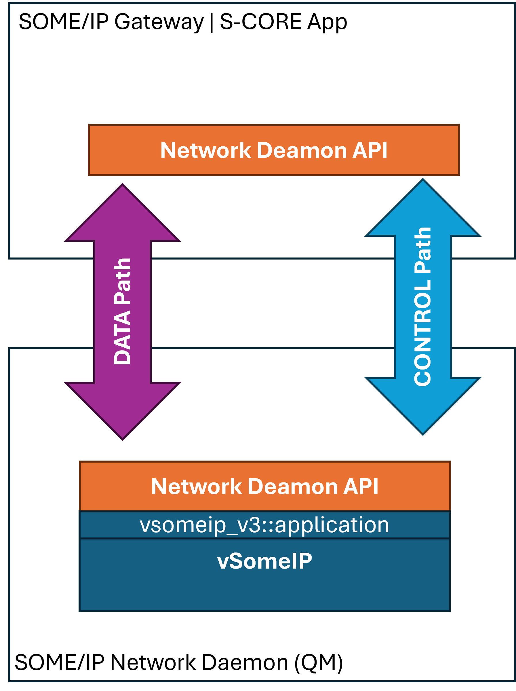

# SOME/IP Network Daemon Design Proposal

## Intro

Because of safety considerations we have a specific `SOME/IP network daemon`, which is responsible to handle the SOME/IP
related network communication.
It will be based on the open source SOME/IP implementation `vSomeIP`, which is provided [here](https://github.com/COVESA/vsomeip/blob/master/README.md).

Within S-CORE architecture, there will be different upper layers, which all need to use this network daemon. Currently
under discussion:
- Generic SOME/IP Gateway Daemon
- OEM specific SOME/IP Gateway Daemon
- S-CORE application using `score::mw::com` with a specific SOME/IP binding

The interfacing with the `SOME/IP network daemon` shall be identical for all upper layers.
In this proposal we define a common architecture, which should end up in re-usable building blocks/libs, which are then
used by all upper layers uniformly.

## Basic Architecture

There exist two "channels" between the `SOME/IP network daemon` and an upper layer using/relying on it:

- a DATA channel
- a CONTROL channel

we explicitly separate these two channels as we intend to implement them with different technical mechanisms.

### DATA channel

The DATA channel transports the (SOME/IP) service instance related data. This is:

- Event payloads
- Field payloads
- Method payloads (in-arguments and return values)

We intend to use shared-memory to implement the DATA channel. Mainly because payloads listed above might be large and
using shared-memory as exchange mechanism might save copies in certain cases, which helps with performance.
Additionally: Since there are already existing building blocks for shared-memory communication either in the more high
level form of the `score::mw::com` SHM/LoLa binding or in its underlying `lib/memory/shared`.

Initially we plan implement this by DATA channel via creation of corresponding `score::mw::com` skeletons and proxies
with LoLa/SHM binding. This already provides us with the underlying shared-memory storage!
If we later discover, that using high-level proxy/skeleton abstraction isn't flexible enough (gives too many constraints),
we can refactor in a way to use `lib/memory/shared` directly to build a better tailored shared-memory DATA channel

### CONTROL channel

The CONTROL channel is used to notify events occurring at one layer to the adjacent layer (upper layer to lower layer
and vice versa). These events may be related to:

- DATA updates (notification, that event/field/method data has been updated)
- service-discovery activities (initiating find/search, discovery results)
- subscription activities

The CONTROL channel will be implemented based on `score::message_passing`, which is located [here](https://github.com/eclipse-score/communication/tree/main/score/message_passing).
`score::message_passing` provides:

- unidirectional messaging from client to server
- unidirectional messaging with asynchronous reply from the server side
- synchronous RPC style communication.
- asynchronous notification back from server to client

### `vSomeIP` interface

The main interface being used from `vSomeIP` will be the class `application`
(see [here](https://github.com/COVESA/vsomeip/blob/master/interface/vsomeip/application.hpp)). Thus, the
`Network Daemon API` shown in the picture above, will essentially interface to class `vsomeip_v3::application`!

For resource reasons, there will be only one instance of `vsomeip_v3::application` running within the
`SOME/IP network daemon`.

### Usage of generic proxies and skeletons

As described in [DATA channel](#data-channel), we will use off-the-shelf `score::mw::com` proxies/skeletons to realize
the DATA channel. Since we gain much more flexibility in these gateway biased use cases, when using loosely typed proxies
and skeletons, this proposal relies on `score::mw::com::GenericProxy` (already existing) and
`score::mw::com::GenericSkeleton` (to be developed) instances.

### Service-Discovery usage

From a functional perspective, we could do **without** usage of a service-discovery as the proxies/skeletons are solely
used in a one-to-one relation and the existing CONTROL channel implicitly informs about the existence of the
`score::mw::com::GenericSkeleton` providing the DATA channel.

But since a lot of the proxy side functionality is deeply coupled with service-discovery functionality, bypassing it
seems to generate a lot of effort! Thus, we will use existing `OfferService` (skeleton) and `FindService` (proxy)
functionality.

## Service instance forwarding to SOME/IP network daemon

### SOME/IP service instance identification

When interacting with SOME/IP network daemon (which encapsulates `vsomeip_v3::application`) we introduce the type
`SomeIpServiceInstanceId`, which consists of the tuple of:

- service_t
- instance_t
- major_version_t
- minor_version_t

which come from `vsomeip_v3::application`.

### Steps taken to offer local service instance towards SOME/IP and forward data

These are the steps, to forward a local service instance to the SOME/IP network daemon so that it gets provided as a
SOME/IP service instance on the network:

1. The upper layer creates the DATA channel for the service instance by creating a corresponding
   `score::mw::com::GenericSkeleton` with LoLa/SHM binding.
   It might be sufficient, that each event/field contained in this skeleton has only one sample slot. This would implicitly
   mean, that we will see a data-loss, when the upper layer wants to update an event/field, but the `SOME/IP network daemon`
   is still busy/accessing the single slot.
2. Then the upper layer sends a message via `score::message_passing` to the `SOME/IP network daemon`, to create the
   SOME/IP service instance. Thus, the message contains a tag/message-id `CreateServiceInstance`. Further payload of this
   message:
   - `SomeIpServiceInstanceId` describing the service instance
   - LoLa service type and instance id, which allows the `SOME/IP network daemon` to create the corresponding proxy instance
     to the skeleton created in (1).
3. The `SOME/IP network daemon` receives the message in (2) and creates the proxy from the information contained. I.e. it
   issues a `score::mw::com::GenericProxy::FindService` and expects to get instantly a handle back, from which it then
   creates the proxy instance.
   Afterward, it is capable of accessing the event/field slots: The DATA channel is now set up.
4. The upper layer sends a message via `score::message_passing` to the `SOME/IP network daemon`, to offer the service
   instance created in (1). Thus, the message contains a tag/message-id `OfferServiceInstance`. Further payload of
   this message:
   - `SomeIpServiceInstanceId` describing the service instance
5. The `SOME/IP network daemon`receives the message sent in (4) and then calls `vsomeip_v3::application::offer_event()`
   for each event/field the underlying proxy created in (3) contains and then finally calls
   `vsomeip_v3::application::offer_service()` with the args taken from `SomeIpServiceInstanceId`.
6. After the upper layer sends/updates an event/field on the `score::mw::com` skeleton, it sends a message via
   `score::message_passing` to the `SOME/IP network daemon`, to push the update to the SOME/IP service instance. Thus,
   the message contains a tag/message-id `UpdateEvent`. Further payload of this message:
   - `SomeIpServiceInstanceId` describing the service instance.
   - `EventId` describing which event/field to update
7. The `SOME/IP network daemon`receives the message sent in (6) and then calls `vsomeip_v3::application::send()`
   for the event/field identified by `EventId`. The payload to hand over will be created by accessing the corresponding
   event/field of the `score::mw::com` proxy via `GetNewSamples()`. I.e. only, when `ProxyEvent::GetNewSamples()`
   returns a new `SamplePtr`, a `std::shared_ptr<message>` will be created from it and handed over to the call of
   `vsomeip_v3::application::send()`. After the call returned, the `SamplePtr` can be disposed.

### Steps taken to stop-offer service instance

In case the upper layer only wants to forward a "stop-offer" for its local `score::mw::com` skeleton, it sends a message
via `score::message_passing` to the `SOME/IP network daemon`, to stop the service instance offering. The message
contains a tag/message-id `StopOfferServiceInstance`. Further payload of this message:
- `SomeIpServiceInstanceId` describing the service instance
  The implementation in `SOME/IP network daemon`receives the message and calls
- `vsomeip_v3::application::stop_offer_service()` with the args taken from `SomeIpServiceInstanceId`.

## Service instance reception from SOME/IP network daemon

### Steps taken to receive a SOME/IP service-instance and provide it locally

1. The upper layer sends a message via `score::message_passing` to the `SOME/IP network daemon`, to trigger the search/
   discovery for the service instance on the SOME/IP (network) side. Thus, the message contains a tag/message-id
   `DiscoverServiceInstance`. Further payload of this message:
   - `SomeIpServiceInstanceId` describing the service instance
   - detailed meta-info of all events/fields/methods, which is sufficient, that the `SOME/IP network daemon` can create
     a `score::mw::com::GenericSkeleton` from it.
2. The `SOME/IP network daemon` receives the message in (1) and then calls
   `vsomeip_v3::application::register_availability_handler`. All arguments but one are filled from
   `SomeIpServiceInstanceId`. Last argument is the availability handler (`availability_handler_t`), created by the
   `SOME/IP network daemon`.
3. As soon as the availability handler fires and indicates, that on SOME/IP the instance identified via
   `SomeIpServiceInstanceId` is available, the `SOME/IP network daemon` creates a `score::mw::com::GenericSkeleton`
   based on the arguments received in (1) and sends back a notification to the upper layer via `score::message_passing`
   (`IServerConnection::Notify()`). Thus, the message contains a tag/message-id `ServiceInstanceAvailable`. Further
   payload of this message:
   - `SomeIpServiceInstanceId` describing the service instance
   - `InstanceIdentifier`. describing the created `score::mw::com::GenericSkeleton` instance
4. Then the `SOME/IP network daemon` calls `vsomeip_v3::application::register_message_handler` for each event/field of
   the service instance to register its handler for SOME/IP message reception.
5. When the upper layer receives the notification sent in (3), it calls `score::mw::com::GenericProxy::FindService()`
   with the `InstanceIdentifier` taken from the message and then creates `GenericProxy` instance from the returned
   handle. It now has a "connected" proxy to the SOME/IP service instance.
6. When an event/field update happens for the network side SOME/IP service instance identified by `SomeIpServiceInstanceId`,
   the `SOME/IP network daemon` gets notified via its handler, which it has registered in (4). In its registered handler
   the `SOME/IP network daemon` accesses the received message payload containing event/field data update and calls the
   corresponding `GenericSkeletonEvent`/`GenericSkeletonField` `Send`/`Update` method.
7. The upper layer can then &ndash; via the GenericProxy it has created in (5) &ndash; access updated event/field data
   with the standard mechanisms: (polling based or event notified) `GetNewSamples()`
