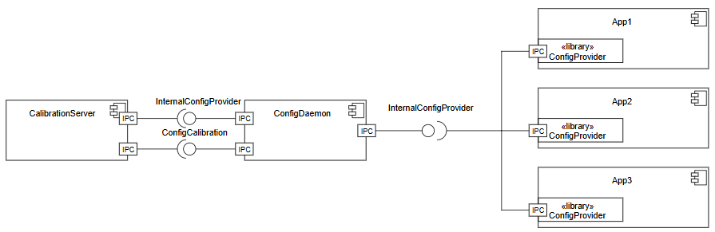

..
   # *******************************************************************************
   # Copyright (c) 2025 Contributors to the Eclipse Foundation
   #
   # See the NOTICE file(s) distributed with this work for additional
   # information regarding copyright ownership.
   #
   # This program and the accompanying materials are made available under the
   # terms of the Apache License Version 2.0 which is available at
   # https://www.apache.org/licenses/LICENSE-2.0
   #
   # SPDX-License-Identifier: Apache-2.0
   # *******************************************************************************

.. _chm_feature_templates:

Feature Request
===============

.. gd_temp:: Feature Request Template
   :id: gd_temp__change__feature_request
   :status: valid
   :complies: std_req__aspice_40__SUP-10-BP1, std_req__aspice_40__SUP-10-BP2, std_req__aspice_40__SUP-10-BP3, std_req__aspice_40__SUP-10-BP5, std_req__aspice_40__iic-18-57, std_req__iso26262__support_8422, std_req__iso26262__support_8431, std_req__iso26262__support_8432

.. attention::
    Remove everything above when copying and filling the template.

Configuration Management
------------------------

.. note:: Document header

.. document:: Configuration Management
   :id: doc__change__feature_name
   :status: draft
   :safety: ASIL_B
   :tags: template

.. attention::
    The above directive must be updated according to your Feature.

    - Modify ``name`` to be your Feature Name
    - Modify ``id`` to be your Feature Name in upper snake case preceded by ``DOC_``
    - Adjust ``status`` to be ``valid``
    - Adjust ``asil`` according to your needs

Feature flag
------------

To activate this feature, use the following feature flag:

``experimental_configuration_management``

    .. note::
     The feature flag must reflect the feature name in snake_case. Further, it is prepended with ``experimental_``, as
     long as the feature is not yet stable.

Abstract
--------

Configuration Management feature is responsible for central storage, verification and modification of individual vehicle configuration properties. A generic interface for applications to access such properties is part of the feature.

Motivation
----------

Embedded software usually needs specific adaptations to a particular vehicle in terms of configuration properties. Such configuration properties are called ``parameters`` in the following abstract. Examples of parameters are vehicle geometry or geographical region of use. Parameters are used in manifold computations and are expected to be constant during a driving cycle in customers hand.
Currently we differntiate between two types of parameters depending on type of configuration and related development process: coding parameters and calibration parameters.

``ConfigDaemon`` application implements an on-target data base for all parameters used in a particular ECU and a generic interface for parameter accesses by user applications.

The basic idea of ``ConfigDaemon`` is justified by the use case of having only flexible runtime dependencies on parameters from the view point of a user application. Generic interface to access a parameter is defined by key-value principle, where key is a unique name for a required parameter and value is any data related to this name. Runtime dependencies have an additional value in comparison to statically defined interfaces for every specific parameter, which have to be resolved at build time. This approach allows to shorten build times and avoids the necessity of system model changes and following re-builds if a parameter changes.

``ConfigDaemon`` is internally structured as

- an application, which implements a parameter data base and interface for parameter access and
- additional plugins, which handle specific kinds of parameters according to OEM functional requirements, like
- coding plugin or
- calibration plugin

Flexibility of the generic interface is achieved by representation of any parameter value as a string. To convert the string representation to the original data type of a parameter an addition library ``ConfigProvider`` is offered. ``ConfigProvider`` is supposed to be integrated in a user application. ``ConfigProvider``, thus, is responsible for

- establishing of communication to ``ConfigDaemon``,
- receiving eventual parameter updates,
- providing of typed access methods to parameters towards a user application.

Rationale
---------

[TBD: Describe why particular design decisions were made.]

   .. note::
      The rationale should provide evidence of consensus within the community and discuss important objections or concerns raised during discussion.

Specification
-------------

[TBD: Describe the requirements, architecture of any new feature.] or
[TBD: Describe the change to requirements, architecture, implementation, process, documentation, infrastructure of any change request.]

   .. note::
      A CR shall specify the stakeholder requirements as part of our platform/project.
      Thereby the :need:`rl__technical_lead` will approve these requirements as part of accepting the CR (e.g. merging the PR with the CR).

Backwards Compatibility
-----------------------

[TBD: Describe potential impact (especially including safety and security impacts) and severity on pre-existing platform/project elements.]

Security Impact
---------------

[TBD: How could a malicious user take advantage of this new/modified feature?]

   .. note::
      If there are security concerns in relation to the CR, those concerns should be explicitly written out to make sure reviewers of the CR are aware of them.

Which security requirements are affected or has to be changed?
Could the new/modified feature enable new threat scenarios?
Could the new/modified feature enable new attack paths?
Could the new/modified feature impact functional safety?
If applicable, which additional security measures must be implemented to mitigate the risk?

    .. note::
     Use Trust Boundary, Defense in Depth Analysis and/or Security Software Critically Analysis,
     Vulnerability Analysis.
     [TBD: Methods will be defined later in Process area Security Analysis]

Safety Impact
-------------

[TBD: How could the safety be impacted by the new/modified feature?]

   .. note::
      If there are safety concerns in relation to the CR, those concerns should be explicitly written out to make sure reviewers of the CR are aware of them.
      Link here to the filled out :need:`Impact Analysis Template <gd_temp__change__impact_analysis>` or copy the template in this chapter.

Which safety requirements are affected or has to be changed?
Could the new/modified feature be a potential common cause or cascading failure initiator?
If applicable, which additional safety measures must be implemented to mitigate the risk?

    .. note::
     Use Dependency Failure Analysis and/or Safety Software Critically Analysis.
     [TBD: Methods will be defined later in Process area Safety Analysis]

For new feature contributions:

ASIL B

License Impact
--------------

[TBD: How could the copyright impacted by the license of the new contribution?]

How to Teach This
-----------------

[TBD: How to teach users, new and experienced, how to apply the CR to their work.]

   .. note::
      For a CR that adds new functionality or changes behavior, it is helpful to include a section on how to teach users, new and experienced, how to apply the CR to their work.

Rejected Ideas
--------------

[TBD: Why certain ideas that were brought while discussing this CR were not ultimately pursued.]

   .. note::
      Throughout the discussion of a CR, various ideas will be proposed which are not accepted.
      Those rejected ideas should be recorded along with the reasoning as to why they were rejected.
      This both helps record the thought process behind the final version of the CR as well as preventing people from bringing up the same rejected idea again in subsequent discussions.
      In a way this section can be thought of as a breakout section of the Rationale section that is focused specifically on why certain ideas were not ultimately pursued.

Open Issues
-----------

[TBD: Any points that are still being decided/discussed.]

   .. note::
       While a CR is in draft, ideas can come up which warrant further discussion.
       Those ideas should be recorded so people know that they are being thought about but do not have a concrete resolution.
       This helps make sure all issues required for the CR to be ready for consideration are complete and reduces people duplicating prior discussion.

Footnotes
---------

[TBD: A collection of footnotes cited in the CR, and a place to list non-inline hyperlink targets.]
