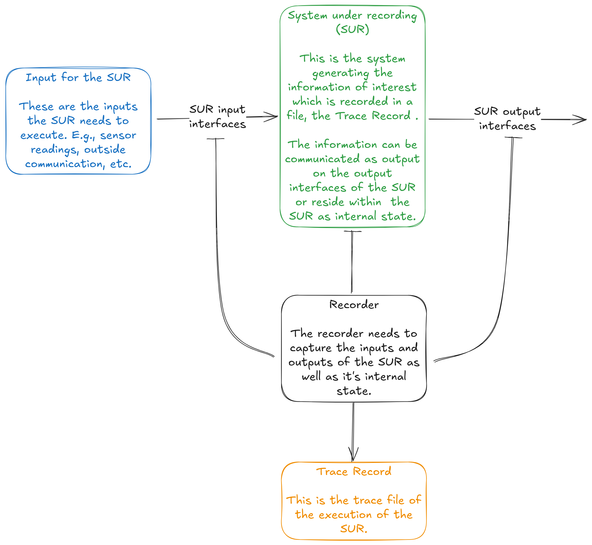
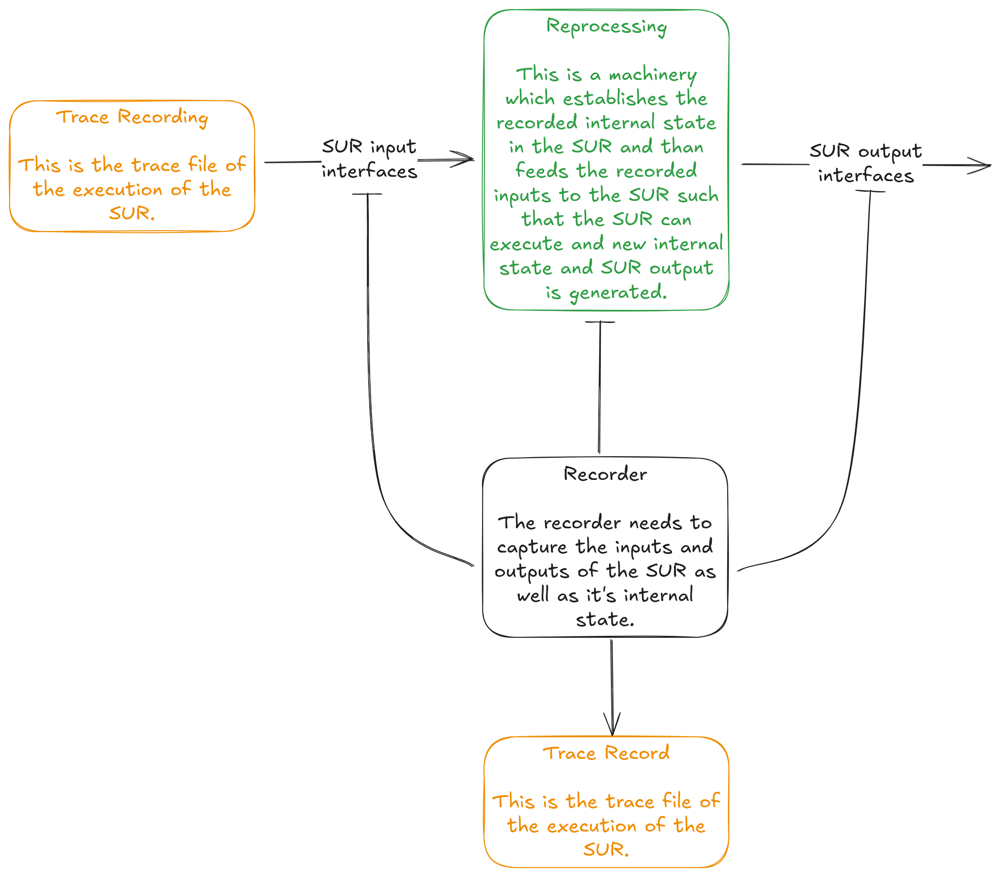
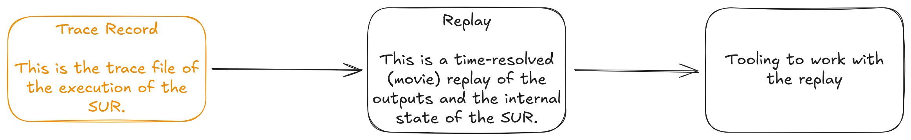
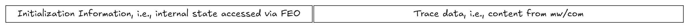

..
   # *******************************************************************************
   # Copyright (c) 2025 Contributors to the Eclipse Foundation
   #
   # See the NOTICE file(s) distributed with this work for additional
   # information regarding copyright ownership.
   #
   # This program and the accompanying materials are made available under the
   # terms of the Apache License Version 2.0 which is available at
   # https://www.apache.org/licenses/LICENSE-2.0
   #
   # SPDX-License-Identifier: Apache-2.0
   # *******************************************************************************

.. _record_and_replay_feature:

Recording and Tracing
#####################

.. document:: Recording and Tracing
   :id: doc__record_and_replay
   :status: draft
   :safety: tbd
   :tags: feature_request

Feature flag
============

To activate this feature, use the following feature flag:

``experimental_record_and_replay``

Abstract
========

Recording is a function allowing to record a trace, called a *Trace Record*, of
the activity of the system while it is executing. Replay is a function which
allows to inspect the activity of the system at a later point in time.
Reprocessing is a function which allows to execute the system using a Trace
Record as stimulus. Recording, replay or reprocessing can happen in different environments.
E.g., a trace can be recorded in the vehicle. It can be replayed on a developer's
machine for debugging. It can also be used in a compute backend as input for
large-scale functional validation and testing using reprocessing.

Motivation
==========

This feature request is connected to the log and trace capabilities of mw.
Integration with existing functions and features will be discussed in a
follow-up meeting.

Rationale
=========

A Trace Record can be used it two different ways. It can be replayed to
inspect the time-resolved behavior of the recorded system (movie). This usage is
called *Replay* in the following. It can also be used as input to the same
system which has originally been recorded such that that system can be executed
and runtime-inspected. This usage is called *Reprocessing* in the following.
Let's take a close look at Recording, Replay, and Reprocessing.

Recording
---------
Recording is the activity of capturing the input, output, and possibly the
internal state of a defined system, the System Under Recording (SUR).

|record|

* **Input:** The blue box depicts all parts of the larger system which generates
  inputs consumed by the SUR via its input interfaces.
* **System under Record:** The System Under Record (SUR), green box, is the
  system of which the runtime behavior shall be recorded. It consumes its
  inputs, executes on them, and generates its outputs. While executing, the SUR
  might acquire internal state.
* **Recorder:** The Recorder is a function able to read inputs, outputs, and
  possibly the internal state of the SUR and writes them time-ordered to a file,
  the Trace Record.
* **Trace Record:** The Trace Record is the artifacts produced by the recorder,
  yellow box.

Replay
------

Replay unfolds the Trace Record in time allowing to inspect the system behavior as
is has been recorded.

|replay|

* **Trace Record:** The Trace Record is the artifact created earlier and is the input
  to "Replay".
* **Replay:** This is a function to read the Trace Record and unfold it in time to
  inspect the system behavior and make the content of the Trace Record accessible
  to tooling.

Reprocessing
------------

Reprocessing takes a Trace Recording and any compatible version of the SUR. The
SUR is started up and its usual inputs are replaced by the ones recorded in the
Trace Record. That way, reprocessing allows to execute the SUR again on recorded
inputs, making is possible to

* inspect the runtime behavior of the SUR at any point in time, but also to
* investigate the behavior of another version of the SUR compared to what
  version was used for recording.

|reprocessing|

To reproduce the internal behavior of the SUR when reprocessing, its original
internal state at the beginning of the recording must be available to properly
initialize the SUR. Consequently, the original internal state must be part of
the Trace Record.

A trace can be recorded from Reprocessing in a similar way as from a SUR. That
Trace Record can be used for both use-cases, replay and reprocessing.

Specification
=============

Given the discussion in section `Rational <#Rationale>`_ we arrive at the
following requirements.

Requirements for the recording of traces
----------------------------------------

* A Trace Record shall be able to capture all information necessary to later
  initialize the SUR for reprocessing to the exact state it has when recording
  started.

  .. note::
     A possible design would be to have a header part of the Trace Record which stores the
     initialization information, followed by the trace recording.

     |trace|

* Initialization information shall only be written once to the Trace Record.
* The time-gap between the recorded initialization information and the first
  recorded sample of continuous trace data (from mw/com) shall be minimal.

  .. note::
     Ideally, the initialization information is recorded from execution step n-1 and
     recording from mw/com start with execution step n. A more relaxed, but less
     precise requirement, is that the recorded initialization information and the
     recordings from mw/com shall *fit together*. That, however, is very context dependent
     and might be an ill-posed problem for our scope.
* Activities (replace with the correct term from FEO denoting an **execution
  unit**) shall be able and required to register (with a recording daemon) their
  internal state needed to reestablish its state for initialization for
  reprocessing.
* The Trace Record shall resemble the time-order of messages as seen by FEO at
  execution time. (Do we need that requirement?)

Requirements for reprocessing of traces
---------------------------------------

* The S-CORE stack shall provide the possibility to execute in an artificial
  environment in which inputs are provided from a Trace Record. This execution
  mode is called **Reprocessing**.
* Reprocessing shall use already established communication interfaces. A
  special reprocessing input path for data is to be avoided.
* On initialization of Reprocessing all activities, for which initialization
  information is available in the Trace Record, shall be restored to that state.
* All output interfaces shall publish in reprocessing such that a **reprocessed
  trace** can be recorded.

Backwards Compatibility
=======================

[Describe potential impact (especially including safety and security impacts) and severity on pre-existing platform/project elements.]

Security Impact
===============

[How could a malicious user take advantage of this new/modified feature?]

   .. note::
      If there are security concerns in relation to the CR, those concerns should be explicitly written out to make sure reviewers of the CR are aware of them.

Which security requirements are affected or has to be changed?
Could the new/modified feature enable new threat scenarios?
Could the new/modified feature enable new attack paths?
Could the new/modified feature impact functional safety?
If applicable, which additional security measures must be implemented to mitigate the risk?

    .. note::
     Use Trust Boundary, Defense in Depth Analysis and/or Security Software Critically Analysis,
     Vulnerability Analysis.
     [Methods will be defined later in Process area Security Analysis]
     These analyses may not be available at the time of creation of the feature (request) but content will be improved iteratively.

Safety Impact
=============

[How could the safety be impacted by the new/modified feature?]

Which safety requirements are affected or has to be changed?
Could the new/modified feature be a potential common cause or cascading failure initiator?
If applicable, which additional safety measures must be implemented to mitigate the risk?

    .. note::
     Use Dependency Failure Analysis and/or Safety Software Critically Analysis.
     [Methods will be defined later in Process area Safety Analysis]
     These analyses may not be available at the time of creation of the feature (request) but content will be improved iteratively.

For new feature contributions:

[What is the expected ASIL level?]

License Impact
==============

[How could the copyright impacted by the license of the new contribution?]

How to Teach This
=================

[How to teach users, new and experienced, how to apply the CR to their work.]

   .. note::
      For a CR that adds new functionality or changes behavior, it is helpful to include a section on how to teach users, new and experienced, how to apply the CR to their work.

Rejected Ideas
==============

[Why certain ideas that were brought while discussing this CR were not ultimately pursued.]

   .. note::
      Throughout the discussion of a CR, various ideas will be proposed which are not accepted.
      Those rejected ideas should be recorded along with the reasoning as to why they were rejected.
      This both helps record the thought process behind the final version of the CR as well as preventing people from bringing up the same rejected idea again in subsequent discussions.
      In a way this section can be thought of as a breakout section of the Rationale section that is focused specifically on why certain ideas were not ultimately pursued.

Open Issues
===========

[Any points that are still being decided/discussed.]

   .. note::
       While a CR is in draft, ideas can come up which warrant further discussion.
       Those ideas should be recorded so people know that they are being thought about but do not have a concrete resolution.
       This helps make sure all issues required for the CR to be ready for consideration are complete and reduces people duplicating prior discussion.

Footnotes
=========

[A collection of footnotes cited in the CR, and a place to list non-inline hyperlink targets.]

