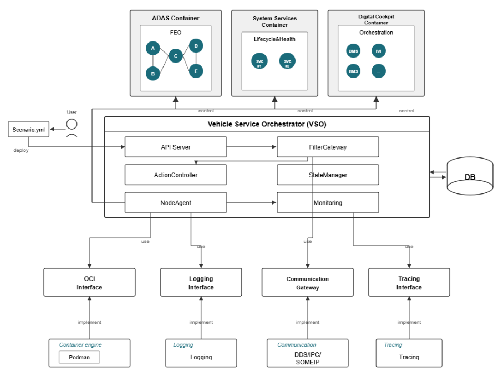

# *******************************************************************************
# Copyright (c) 2025 Contributors to the Eclipse Foundation
#
# See the NOTICE file(s) distributed with this work for additional
# information regarding copyright ownership.
#
# This program and the accompanying materials are made available under the
# terms of the Apache License Version 2.0 which is available at
# https://www.apache.org/licenses/LICENSE-2.0
#
# SPDX-License-Identifier: Apache-2.0
# *******************************************************************************

.. _vso_feature:

Vehicle Service Orchestrator
#############################

.. document:: Vehicle Service Orchestrator
   :id: doc__vso
   :status: draft
   :safety: ASIL_B
   :security: YES
   :tags: feature_request
   :realizes: wp__feat_request

.. toctree::
   :maxdepth: 1
   :glob:
   :titlesonly:
   :hidden:

   requirements/index

Feature flag
============

To activate this feature, use the following feature flag:

``experimental_vehicle_service_orchestrator``

Abstract
========

We propose adding a vehicle-specialized orchestration framework that adapts cloud-native container technologies to the in-vehicle environment.
The Vehicle Service Orchestrator (VSO) extends cloud-native orchestration with vehicle-specific capabilities,
enabling applications developed in the cloud to be deployed to the vehicle without modification.
It supports explicit resource management for mixed-criticality workloads and provides execution guarantees and automatic recovery for safety-critical applications.

The term "Vehicle Service Orchestrator" reflects the orchestrator's role in managing services under the unique operational conditions of a vehicle,
rather than simply adapting a cloud-native orchestrator.
Unlike traditional container orchestrators designed for scalable datacenter environments,
a vehicle-specific orchestrator must account for constrained compute budgets,
strict isolation between workloads of differing criticality,
and continuous operation under varying driving conditions.
The name emphasizes that its primary purpose is to coordinate and safeguard in-vehicle services in a manner appropriate for automotive constraints,
bridging cloud-native development models with the operational realities of the vehicle environment.

The intent of this feature request is to define a high-level architecture for the Vehicle Service Orchestrator.
The components listed throughout this document may require detailed feature requests in the future respectively.

Motivation
==========

1. Complexity and Platform Dependency in Vehicle Software Deployment
---------------------------------------------------------------------

Current vehicle software deployment faces significant constraints due to complex multi-stage validation processes,
platform-specific customized builds, and limited update mechanisms.
In a typical deployment scenario, any modification to an application requires repeated validation across the development, testing, and vehicle environments,
and each validation stage must faithfully reproduce the same execution environment.
Integration issues frequently occur due to environment inconsistencies,
and model-specific builds are unavoidable because each vehicle ECU uses different hardware architectures (x86, ARM, RISC-V)
and different OS conditions (Linux distributions, kernel versions, library dependencies).

During OTA updates, a full system reboot is often required, rollback capabilities are limited, and recovering from update failures is challenging.
Version management also becomes unnecessarily complex.
To address these challenges, vehicle-optimized orchestration technology is required—one that enables "build once, run anywhere" through container-based deployment,
defines deployment state with a declarative Manifest, and supports automated rollout and rollback.
A lightweight solution that accounts for limited in-vehicle resources and real-time constraints is essential.

2. Application Behavior in Mixed-Criticality Domains
-----------------------------------------------------

Vehicle software is composed of applications with variant execution requirements depending on their safety level.
For example, an ASIL-D Automatic Emergency Braking (AEB) system requires strict timing guarantees,
while a QM-level infotainment system can tolerate delays.
This mixed-critical structure also applies when distributing workloads across high-performance and low-performance ECUs.

Expected issues in this execution model include resource contention and inappropriate node placement between critical and non-critical applications.
For instance, an infotainment application consuming excessive CPU resources could delay object detection in AEB or increase braking response time—posing a significant safety risk.

To address these challenges, ASIL-D applications must be allocated dedicated CPU cores and memory, while QM applications should share resources.
Furthermore, dynamic resource reallocation is necessary to ensure the execution guarantees and timing requirements of safety-critical functions when driving conditions change (e.g., urban → highway).
Since standard cloud-native orchestration does not inherently understand ASIL concepts or guarantee prioritization for safety-critical workloads,
a vehicle-optimized orchestrator is required.

Rationale
=========

1. Selection of a Cloud-Native Orchestration Foundation
--------------------------------------------------------

This feature is built upon cloud-native orchestration technologies that have already been validated at scale in cloud environments.
Container orchestration systems proven in the cloud provide core capabilities such as declarative deployment, automatic recovery, and rolling updates,
all of which can be directly applied to address the complexity and platform dependency issues found in vehicle software deployment.
By optimizing these proven cloud technologies for the in-vehicle environment, development time can be reduced while improving overall system reliability.

2. Extension Architecture for Vehicle-Specific Capabilities
------------------------------------------------------------

The reason we adopted an extension architecture—adding vehicle-specific capabilities instead of using the existing cloud-native orchestrator as-is—is
the fundamental difference between vehicle and cloud environments.
Cloud systems assume virtually infinite scalability, persistent network connectivity, and 99.9% availability,
whereas vehicles operate under constrained resources, intermittent connectivity, 99.9999% availability requirements, and stringent real-time constraints.
In particular, mixed-criticality management based on ASIL levels is a requirement unique to automotive systems and does not exist in cloud environments.
Therefore, while the base orchestration features are reused, extensions such as mixed-criticality awareness, real-time scheduling,
and vehicle-specific health checks are added.

3. Declarative Manifest-Based Configuration
--------------------------------------------

Defining ASIL levels, resource allocations, and dependencies through a declarative Manifest separates the responsibilities of developers and integrators
while reducing deployment complexity.
In traditional workflows, developers must manually manage platform-specific build scripts, environment variables, and resource settings,
requiring repetitive adjustments whenever the vehicle model or ECU changes.
With a declarative Manifest, developers specify what to deploy, while the orchestrator determines how to deploy it.
This allows developers to focus on application logic while integrators adjust only the Manifest to support diverse vehicle environments.

4. Portability Without Application Code Changes
------------------------------------------------

The decision to allow cloud-developed applications to be deployed to vehicles without modifying their code is driven by the need for development productivity and ecosystem utilization.
Previously, porting a cloud application to a vehicle required manual adjustments to platform-specific library dependencies, environment variables,
and network configurations—introducing delays and increasing the likelihood of errors.
Container-based deployment encapsulates the application and all of its dependencies into an image, ensuring a consistent execution environment across cloud and vehicle platforms.
The orchestrator abstracts environment-specific differences such as networking, storage, and security.
This enables immediate reuse of cloud-validated applications and frameworks (e.g., AI inference engines, data processing pipelines) within the vehicle
while significantly reducing integration overhead through consistent cloud-to-vehicle development environments.

5. Container-Based Isolation and Resource Management
-----------------------------------------------------

Managing all applications—including the Executor—within containers ensures explicit resource management and consistent runtime environments.
Previously, the Executor existed as a Rust package with implicit and manually maintained resource allocation,
which risked violating FEO guarantees when additional applications were introduced.
Through container isolation, each Executor can be explicitly assigned dedicated CPU cores, memory, and GPU resources.
cgroup and namespace isolation prevents interference from other workloads.
Additionally, container images enable "build once, run anywhere," providing platform independence across heterogeneous hardware architectures such as x86, ARM, and RISC-V.

6. Real-Time Monitoring and Automatic Recovery Mechanisms
----------------------------------------------------------

The design choice to support real-time monitoring and automated recovery of resource usage, timing metrics, and health status is essential
due to the safety requirements and operational complexity of vehicle environments.
Previously, when the Executor crashed or timing constraints were violated, issues were only logged and required manual investigation and restart,
with little visibility into root causes.
In vehicular systems, interruptions to safety-critical functions can directly affect human life, making millisecond-level fault detection and recovery indispensable.
Periodic health checks via a Liveness Probe, timing-constraint validation using a Timing Probe, and immediate restart policies upon failure ensure
continuity of critical functions without human intervention.
Collecting metrics such as CPU and memory usage, per-task execution time, and timing violation counts enables both post-incident analysis and proactive prevention.

Specification
=============

Overview
--------

A Vehicle Service Orchestrator is a structured and declarative framework for managing the execution flow, timing constraints, and error handling of containers.
Developers can define application control flows and resource-management policies in a platform-independent manner,
while the orchestration automates container deployment, execution guarantees, and dynamic resource allocation.
This clearly separates application logic from infrastructure management, enabling stable and vehicle-optimized operation.

System Architecture
-------------------

The system follows a three-layer architecture specialized for in-vehicle environments:
- **API Layer:** API Server Allows the user to configure(add/remove) the Manifest
- **Orchestration Layer:** vehicleData FilterGateway, ActionController and StateManager coordinate workloads
- **Agent Layer:** NodeAgent handles execution on each node
- **Runtime Layer:** Container engine performs actual container operations

Core Components
---------------
**APIServer**
  Interfaces with user to add or remove the manifest(scenarios)

**Vehicle Data Filtergateway**
 Services are automatically controlled based on changes in vehicle state.

**ActionController**
  Scenario-based workload control and real-time scheduling

**StateManager**
  Tracking container lifecycle and managing state transitions

**NodeAgent**
  Container execution and resource management per node

Workload Lifecycle Management
------------------------------

Standard Command Set
--------------------

Seven essential workload commands are supported:

- ``create``
- ``start``
- ``pause``
- ``resume``
- ``stop``
- ``restart``
- ``delete``

All commands are delivered via remote procedure calls and follow a standardized response format.

Container State Model
---------------------

Containers are managed across five main states:

- **Created:** Image ready for execution
- **Running:** Active execution
- **Paused:** Memory preserved, execution suspended
- **Exited:** Normal or error termination
- **Restarting:** Automatic recovery in progress

Transitions between these states follow strict rules enforced by the StateManager.

Scenario-Based Automation
--------------------------

Conditional Execution Engine
----------------------------

Services are automatically controlled based on changes in vehicle state.
Scenario information is retrieved from a distributed key-value store, and corresponding actions are executed automatically when conditions are met.
Integration with real-time data streams ensures immediate responsiveness.

Resource Management and Isolation
----------------------------------

Container Security Isolation
----------------------------

User identifiers, group permissions, and Linux capabilities are strictly controlled according to the principle of least privilege.
Restricting privileged mode and applying security contexts strengthens system-level protection.

Performance Optimization
------------------------

Processor and memory usage are tracked in real time, allowing early detection of resource shortages.
Parallel container creation, asynchronous processing, and automatic scaling optimize startup times and maximize efficiency.

Monitoring and Recovery
------------------------

State Monitoring
----------------

Comprehensive health checks continuously monitor:

- Process status
- Port connectivity
- Application-level health (Liveness Probe)
- Timing constraints (Timing Probe)
 process status, port connectivity, and application-level health.Failure recovery is automated according to restart policies.
 Failed containers are automatically restarted, and state-based corrective actions minimize operational downtime.
 Customized recovery logic is applied depending on the error type.

Requirements
------------

The related requirements can be found in :doc:`requirements/index`.

Backwards Compatibility
=======================

This feature is designed as an optional extension module that does not modify the existing S-CORE architecture.
No changes are required to the current Executors (FEO, Lifecycle, Orchestration) or to application logic.
Container-based deployment and resource-management features are applied only to services that require them,
while existing process-based workloads remain fully preserved.

The Manifest operates as an additional configuration layer that can be used alongside the existing Launch mechanism rather than replacing it.
The image-delivery pipeline, data formats, and OS initialization procedures (Linux/QNX) remain unchanged.
Furthermore, safety and security features complement—rather than replace—current mechanisms,
ensuring full backward compatibility for the entire platform and all existing applications.

Security Impact
===============

The introduction of a Vehicle Service Orchestrator has security implications due to its system-level capabilities and distributed nature.
The orchestrator manages container lifecycle, resource allocation, and network access—all of which pose risks if accessed by unauthorized actors.

Container isolation provides security boundaries, but misconfigured containers or privileged containers could expose the host system.
Remote procedure calls between orchestration components introduce network attack surfaces that must be secured with mutual TLS and authentication.
The distributed key-value store used for configuration must be protected against unauthorized modification.

To mitigate these risks, the Vehicle Service Orchestrator shall:

- Enforce the principle of least privilege for all containers
- Restrict privileged mode and dangerous Linux capabilities
- Implement mutual TLS authentication for all inter-component communication
- Apply security contexts (SELinux, AppArmor) to containers
- Validate and sanitize all Manifest inputs
- Audit all orchestrator operations for security monitoring

Since the orchestrator manages both QM and ASIL workloads, a security breach must not violate safety guarantees.
Resource isolation mechanisms (cgroups, namespaces) must be robust enough to prevent QM workload compromises from affecting ASIL workloads.
The orchestrator components themselves must be developed with safety-appropriate quality standards to provide FFI (Freedom From Interference) guarantees.

Safety Impact
=============

The Vehicle Service Orchestrator is classified as **ASIL_B** due to its role in managing safety-critical workloads.

While the orchestrator does not directly implement safety functions (e.g., braking, steering),
it provides the runtime environment and resource guarantees necessary for safety-critical applications to meet their timing and reliability requirements.
A failure in the orchestrator's resource allocation, timing enforcement, or automatic recovery mechanisms could indirectly impact safety by:

- Causing timing violations in ASIL-D applications (e.g., delayed object detection in AEB)
- Allowing resource contention between QM and ASIL workloads
- Failing to restart safety-critical containers after crashes

To address these risks:

- ASIL-level workloads are allocated dedicated, isolated resources
- Timing constraints are continuously validated with millisecond-level precision
- Automatic recovery mechanisms ensure continuity of critical functions
- The orchestrator enforces FFI (Freedom From Interference) between criticality levels
- Health checks and monitoring detect failures immediately

The core orchestrator components (ActionController, StateManager, NodeAgent) must be developed according to ASIL_B quality standards.
Safety analysis (FMEA, DFA) will be conducted to identify and mitigate potential failure modes.

License Impact
==============

The Vehicle Service Orchestrator is built upon open-source container technologies.
The base container runtime and orchestration concepts are freely available under permissive licenses (Apache 2.0, MIT).

However, specific implementation choices may introduce license considerations:

- Container runtime engines (e.g., containerd, runc) are typically Apache 2.0 licensed
- Kubernetes components (if used as a base) are Apache 2.0 licensed
- Linux kernel features (cgroups, namespaces) are GPL but do not affect userspace licensing
- Automotive-specific extensions will be developed as S-CORE components under Apache 2.0

No license restrictions prevent the implementation of an open-source Vehicle Service Orchestrator at this time.

How to Teach This
=================

For developers familiar with cloud-native technologies (Kubernetes, Docker), the Vehicle Service Orchestrator will feel familiar
with automotive-specific extensions for ASIL levels and real-time constraints.

For automotive engineers unfamiliar with containers, the following learning path is recommended:

1. **Container Basics:** Understand container images, isolation, and resource management
2. **Declarative Configuration:** Learn Manifest-based deployment vs. imperative scripting
3. **Mixed-Criticality Concepts:** Understand ASIL_Based resource allocation and FFI
4. **Orchestration Patterns:** Learn automatic recovery, health checks, and state management
5. **Vehicle-Specific Adaptations:** Understand timing probes, scenario-based automation, and constrained resource management

Reference implementations, tutorials, and example Manifests will be provided to accelerate onboarding.

Rejected Ideas
==============

Process-Based Orchestration Without Containers
-----------------------------------------------

Managing workloads as native processes without container isolation was considered but rejected.
Containers provide explicit resource boundaries, consistent runtime environments, and platform portability that are difficult to achieve with bare processes.
The "build once, run anywhere" benefit of containers significantly outweighs the overhead of container runtime.

Full Kubernetes Deployment
---------------------------

Deploying unmodified Kubernetes as the vehicle orchestrator was considered but rejected.
Kubernetes assumes datacenter-scale resources, persistent network connectivity, and does not understand automotive safety concepts (ASIL levels, timing constraints).
The resource overhead and complexity of Kubernetes are inappropriate for constrained vehicle environments.
An automotive-optimized orchestrator provides better resource efficiency and safety integration.

Static Configuration Without Scenario-Based Automation
-------------------------------------------------------

Using static configuration files without dynamic scenario-based automation was considered but rejected.
Vehicles operate in highly dynamic environments (urban vs. highway, parking vs. driving) that require runtime adaptation.
Static configuration cannot optimize resource allocation or workload placement based on driving conditions.
Scenario-based automation is essential for efficient mixed-criticality management.

Open Issues
===========

- Define detailed Manifest schema and validation rules
- Specify distributed key-value store selection and configuration
- Determine container runtime selection (containerd vs. alternatives)
- Define metrics collection format and integration with S-CORE monitoring
- Specify integration points with existing S-CORE Lifecycle Management
- Determine OTA update flow for containerized workloads
- Define certification and qualification strategy for ASIL_B components
- Specify testing strategy for mixed-criticality scenarios
- Determine multi-ECU orchestration and cross-node communication patterns
- Define failure mode analysis and safety case structure
- Specify resource reservation strategy for different driving scenarios
- Determine integration with S-CORE::COM for inter-container communication

Footnotes
=========
# *******
# .. [#v1] "Kubernetes Documentation", Kubernetes, https://kubernetes.io/docs/.
# .. [#v2] "ISO 26262 Road vehicles — Functional safety", ISO, https://www.iso.org/standard/68383.html.
# .. [#v3] "OCI Runtime Specification", Open Container Initiative, https://github.com/opencontainers/runtime-spec.
# ********
