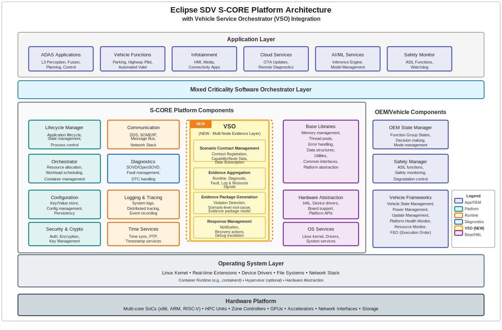
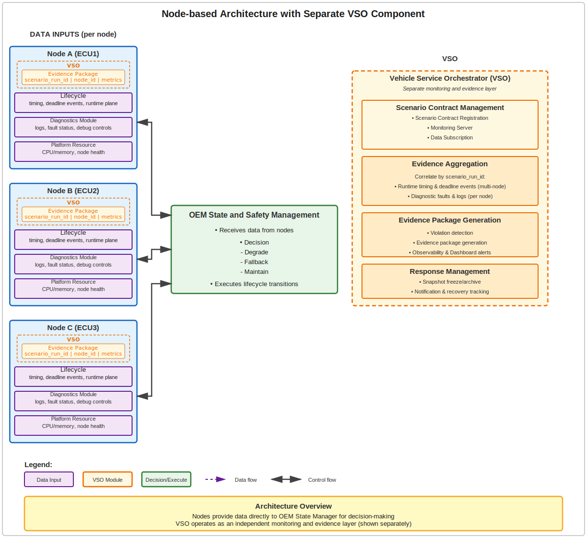
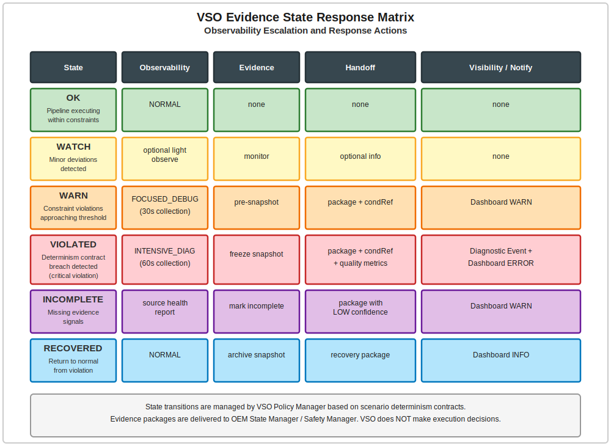
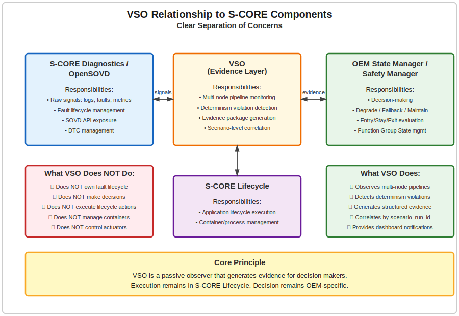

..
   # *******************************************************************************
   # Copyright (c) 2026 Contributors to the Eclipse Foundation
   #
   # See the NOTICE file(s) distributed with this work for additional
   # information regarding copyright ownership.
   #
   # This program and the accompanying materials are made available under the
   # terms of the Apache License Version 2.0 which is available at
   # https://www.apache.org/licenses/LICENSE-2.0
   #
   # SPDX-License-Identifier: Apache-2.0
   # *******************************************************************************

.. _vso_feature:

Vehicle Service Orchestrator
#############################

.. document:: Vehicle Service Orchestrator
   :id: doc__vso
   :status: draft
   :safety: ASIL_B
   :security: YES
   :tags: feature_request
   :realizes: wp__feat_request

.. toctree::
   :maxdepth: 1
   :glob:
   :titlesonly:
   :hidden:

   requirements/index

Feature flag
============

To activate this feature, use the following feature flag:

``experimental_vehicle_service_orchestrator``

Abstract
========

Vehicle Service Orchestrator (VSO) is a Multi-node Scenario Evidence Layer for Eclipse SDV S-CORE.

VSO defines multi-node scenario contracts (pipeline chains) and subscribes to runtime/diagnostic/platform signals.
monitors pipeline execution determinism, detects policy violations at scenario level, and correlates evidence using scenario_run_id.

VSO does NOT own diagnostic fault lifecycle, does NOT decide Function Group State, and does NOT execute application lifecycle.
VSO hands off determinism evidence packages and conditionRefs to Safety Managers for final safety decisions and approvals. 
Execution is performed by S-CORE Lifecycle.

**Core Proposal:**

- VSO does not execute
- VSO does not decide
- VSO observes multi-node scenario pipelines
- VSO detects determinism policy violations
- VSO generates structured evidence
- VSO delivers evidence packages for decisions and statemanagement.

Execution remains in S-CORE Lifecycle. Safety Decisions remain external to S-CORE.

The intent of this feature request is to define the architecture and interfaces for the Vehicle Service Orchestrator 
as a scenario evidence layer that complements existing S-CORE Diagnostics, Lifecycle and Orchestrator components.

Motivation
==========

Problem Statement
-----------------

Modern SDV scenario pipelines (L3 Highway, Parking/Valet, ADAS services) span HPC, Zonal Controllers and ECUs.
Policy based decisions become ineffective without VSO Evidences, such as decisions to switch Autonomous mode to Manual mode, or degrade to a lower ASIL level.
Pipeline stages have timing, resource, dependency and diagnostic constraints.

**What goes wrong without VSO:**

- Raw diagnostic data is available, but scenario-level operational evidence is not standardized
- Policy violation data is often lost, late, or not correlated by scenario_run_id
- Orchestrators may accidentally become state decision makers
- Diagnostic fault lifecycle and scenario policy lifecycle may be mixed
- Debug escalation is ad-hoc and not contract-driven
- Lack of structured evidence for safety decsisions and learning
- Fleet/cloud analysis loses context and root-cause evidence
- No standard for multi-node scenario evidence layer
- Missing determinism monitoring layer
 
**Gap Analysis:**

- **S-CORE Diagnostics** → "what happened" (raw signals, faults, logs)
- **VSO** → "did multi-node pipeline break determinism ?" (scenario-level evidence)
- **OEM State Manager** → "what should we do" (decision-making)
- **S-CORE Lifecycle** → "execute decision" (lifecycle actions)

S-CORE already has Diagnostics, Lifecycle, Orchestrator, Logging, and FEO-related building blocks. 
VSO is proposed as a scenario evidence policy layer that consumes those signals without duplicating their ownership.

Why VSO Fits S-CORE
-------------------

**S-CORE Direction:**

- Common open-source SDV runtime foundation
- Modular, extensible, safety-ready stack
- Feature requests can propose structural changes and new functionality

**Diagnostics Direction:**

- S-CORE Diagnostics proposes SOVD-based diagnostics
- Real-time fault access and advanced data handling
- Diagnostic feature scope

**VSO Alignment:**

VSO aligns with S-CORE's feature request process by introducing a bounded, scenario operational feature 
that does not bypass safety or execution authority. VSO complements existing S-CORE components:

- **Diagnostics:** VSO consumes diagnostic outputs; it does not redefine diagnostics
- **VSO:** VSO generates evidence; safety managers make decisions
- **Lifecycle:** VSO observes; Lifecycle executes

Rationale
=========

Multi-node Scenario Awareness
------------------------------

**What "true multi-node awareness" actually means:**

A system is multi-node aware only if a control entity can answer all four questions at runtime:

1. Which nodes exist right now?
2. What is the role and capability of each node?
3. What is the real-time health of each node (not just apps)?
4. Can workloads be safely placed / moved / stopped across nodes?

S-CORE today can only partially answer #4 inside a single node.

**Health signals S-CORE already provides (baseline):**

1. Component alive / heartbeat
2. Lifecycle state (Init, Running, Error, Terminated)
3. Local application failures
4. Controlled shutdown / restart hooks

These are necessary, but not sufficient for multi-node decision.

**Additional signal categories required for true multi-node awareness:**

- **CATEGORY A:** Node Identity & Topology Signals
- **CATEGORY B:** Node Liveness & Reachability Signals
- **CATEGORY C:** Resource Availability (Node-Level)
- **CATEGORY D:** Safety Capability & ASIL Compatibility Signals
- **CATEGORY E:** Workload Placement Feedback (Cross-Node)
- **CATEGORY F:** Fault Domain & Failure Propagation Signals

**VSO Solution: Multi-node Scenario Evidence Layer**

VSO addresses these gaps by:

- Defining and identifying pipeline chains per Node
- Monitoring end-to-end determinism
- Detecting and correlating violations
- Generating structured evidence packages

OEM State / Safety Manager subscribes and receives:

- Violation type
- Affected nodes
- Confidence level
- conditionRefs for execution adaptation
- evidence quality metrics (freshness, completeness)

Determinism Monitoring
-----------------------

VSO defines and monitors **determinism contracts** enabling multi-node scenarios.

**Key Concepts:**

- **Multi-node Scenario:** A defined pipeline chain and execution dependencies (e.g., L3 Highway: Perception → Fusion → Planning across HPC and zone nodes)
- **Determinism Contract:** Constraints that ensure timing, ordering, and resource guarantees for the entire pipeline (e.g., end-to-end latency ≤ budget, stage ordering preserved, CPU < 90%)
- **Determinism Evidence:** Scenario-level evidence capturing violations of pipeline determinism across nodes
- **Scenario Policy:** Rules for classifying evidence as OK, WATCH, WARN, VIOLATED, or RECOVERED
- **Evidence Package:** Structured package delivered to OEM State Manager / Safety Manager (scenario_run_id, pipeline_id, affected_nodes, violation_type, confidence)

Clear Boundaries
----------------

VSO maintains strict boundaries to avoid conflicting with existing S-CORE components:

**VSO Is:**

- Multi-node scenario evidence layer
- Pipeline determinism monitoring layer
- Scenario contract manager
- Debug/focused collection response coordinator
- Evidence package generator
- Diagnostic visibility publisher
- Operator/dashboard notification source

**VSO Is Not:**

- ASIL safety decision layer
- Diagnostic Fault Manager
- DTC lifecycle owner
- OEM Decision Manager replacement
- Lifecycle/Execution replacement
- Container/process/resource controller
- Actuator/trajectory/emergency braking controller

Specification
=============

Overview
--------

VSO is a Multi-node Scenario Evidence Layer that monitors pipeline chain determinism per node and generates evidence for state and Safety Management.

**Input:**

- Runtime timing (multi-node)
- Diagnostic data / fault status
- Platform resource metrics (per node)

**VSO Processing:**

- Multi-node pipeline monitoring
- Determinism contract evaluation
- Per-node evidence correlation

**Output:**

- Determinism violation evidence package
- conditionRefs for execution adaptation
- Diagnostic/decisions event notification

System Architecture
-------------------

S-CORE Platform Architecture with VSO Integration
--------------------------------------------------

VSO is integrated as a Multi-node Evidence Layer within the Eclipse SDV S-CORE platform architecture, positioned between 
the Diagnostics module and OEM/Vehicle components. The diagram below shows the complete platform architecture with VSO's 
position and interactions:

VSO Architecture Details
-------------------------

The system follows a modular architecture integrated within the S-CORE ecosystem:

- **Data Inputs Layer:** Per-node signals (Runtime Plane, Diagnostics Module, Platform Resources)
- **VSO Core Modules:** Scenario Contract Management, Evidence Aggregation, Evidence Package Generation, Response Management
- **Output Layer:** OEM State Manager / Safety Manager integration, S-CORE Lifecycle handoff

Evidence State Response Matrix
-------------------------------

VSO classifies evidence into six states with corresponding observability and response actions:

.. list-table::
   :header-rows: 1
   :widths: 15 20 20 25 20

   * - State
     - Observability
     - Evidence
     - Handoff
     - Visibility / Notify
   * - OK
     - NORMAL
     - none
     - none
     - none
   * - WATCH
     - optional light observe
     - monitor
     - optional info
     - none
   * - WARN
     - FOCUSED_DEBUG 30s
     - pre-snapshot
     - package + condRef
     - Dashboard WARN
   * - VIOLATED
     - INTENSIVE_DIAG 60s
     - freeze snapshot
     - package + condRef + quality
     - event + Dashboard ERROR
   * - INCOMPLETE
     - source health report
     - mark incomplete
     - package LOW confidence
     - Dashboard WARN
   * - RECOVERED
     - NORMAL
     - archive snapshot
     - recovery package
     - Dashboard INFO

Data Flow
---------

**Per-Node Data Inputs:**

1. **Diagnostics Module:** logs, fault status, debug controls
2. **Platform Resource:** CPU/memory, node pressure/health
3. **Runtime Plane:** stage timing, deadline events, lifecycle signals

**VSO Processing:**

1. **Data Subscription:** Subscribe to Diag/Platform signals per node
2. **Evidence Aggregation:** Correlate runtime, diagnostic, fault, log, and resource signals by scenario_run_id
3. **Scenario Evidence Violation:** Generate scenario-level root-cause evidence package model
4. **Response Management:** Execute notification and recovery actions

**Output to Decision Layer:**

1. **OEM State Manager / Safety Manager:** Receives violation evidence package from VSO
2. **Decision:** OEM/Safety Manager decides (degrade / fallback / maintain)
3. **Execution:** Sends command to S-CORE Lifecycle
4. **S-CORE Lifecycle:** Executes lifecycle transition per OEM/Safety Manager decision

Integration with S-CORE Components
-----------------------------------

**Relationship to S-CORE Diagnostics / OpenSOVD:**

- **Diagnostics/OpenSOVD:** Raw signals (logs, faults, metrics), Fault lifecycle management, SOVD API exposure
- **VSO:** Multi-node pipeline determinism evidence, Violation evidence generation, Evidence package handoff
- **OEM State Manager/Safety Manager:** Decision (degrade / fallback / maintain), Entry/stay/exit evaluation
- **S-CORE Lifecycle:** Application lifecycle execution

VSO consumes diagnostic outputs; it does not redefine diagnostics.
VSO monitors pipeline determinism and generates violation evidence.
OEM State Manager / Safety Manager receives evidence and makes decisions.
S-CORE Lifecycle executes decisions. VSO does not decide or execute.

Requirements
------------

The related requirements can be found in :doc:`requirements/index`.

Value to Eclipse SDV S-CORE
============================

For Developers
--------------

- Scenario-level root-cause evidence
- Evidences escalation by contract
- Reusable sample scenarios (L3 Highway, Parking/Valet)

For Platform
------------

- Clear boundaries with Diagnostics/State/Lifecycle
- Reduced duplicate orchestration logic
- Reusable evidence package model
- Modular integration with existing S-CORE components

For OEMs/Tier-1s
----------------
- Better decision making (decisions to switch Autonomous mode to Manual mode, or degrade to a lower ASIL level.)
- Fleet learning readiness
- Operational degradation traceability
- Structured evidence for safety analysis

**VSO Complements S-CORE:**

- **S-CORE Diagnostics:** VSO turns diagnostic/runtime signals into scenario-level evidence
- **OEM State Manager:** VSO delivers structured evidence instead of unstructured symptoms
- **S-CORE Lifecycle:** VSO keeps execution responsibility in the lifecycle layer

Backwards Compatibility
=======================

- VSO operates as a passive observer consuming existing diagnostic/runtime signals
- OEM State Manager integration is optional and OEM-specific
- VSO can operate as PerNode in virtualization scenario as well as multi node scenario
- Existing fault management and lifecycle workflows remain fully preserved

VSO can be enabled or disabled via the feature flag without affecting existing S-CORE functionality.

The image-delivery pipeline, data formats, and OS initialization procedures (Linux/QNX) remain unchanged.
Furthermore, safety and security features complement—rather than replace—current mechanisms,
ensuring full backward compatibility for the entire platform and all existing applications.

Security Impact
===============

The introduction of a Vehicle Service Orchestrator has security implications due to its system-level capabilities and distributed nature.

Remote procedure calls between orchestration components introduce network attack surfaces that must be secured with mutual TLS and authentication.
The distributed key-value store used for configuration must be protected against unauthorized modification.

To mitigate these risks, the Vehicle Service Orchestrator shall:

- Implement mutual TLS authentication for all inter-component communication
- Validate and sanitize all Manifest inputs
- Audit all orchestrator operations for security monitoring

Since the orchestrator manages both QM and ASIL workloads, a security breach must not violate safety guarantees.
The orchestrator components themselves must be developed with safety-appropriate quality standards to provide FFI (Freedom From Interference) guarantees.

Safety Impact
=============

The Vehicle Service Orchestrator is classified as **ASIL_B** due to its role in managing safety-critical workloads.

While the orchestrator does not directly implement safety functions (e.g., braking, steering),
it ensure the runtime decisions and resource guarantees necessary for safety-critical applications to meet their timing and reliability requirements.
A failure in the orchestrator's resource allocation, timing enforcement, or automatic recovery mechanisms could indirectly impact safety by:

- Causing timing violations in ASIL-D applications (e.g., delayed object detection in AEB)
- Allowing resource contention between QM and ASIL workloads
- Failing to restart safety-critical containers after crashes

To address these risks:

- ASIL-level workloads are allocated dedicated, isolated resources
- Timing constraints are continuously validated with millisecond-level precision
- Automatic recovery mechanisms ensure continuity of critical functions
- Health checks and monitoring detect failures immediately

Safety analysis (FMEA, DFA) will be conducted to identify and mitigate potential failure modes.

License Impact
==============

The Vehicle Service Orchestrator is built upon open-source technologies. However, specific implementation choices may introduce license considerations:

- Linux kernel features (cgroups, namespaces) are GPL but do not affect userspace licensing
- Automotive-specific extensions will be developed as S-CORE components under Apache 2.0

No license restrictions prevent the implementation of an open-source Vehicle Service Orchestrator at this time.

How to Teach This
=================

For developers the Vehicle Service Orchestrator will feel familiar with automotive-specific extensions for ASIL levels and real-time constraints.

For automotive engineers unfamiliar with containers, the following learning path is recommended:

1. **Declarative Configuration:** Learn Manifest-based deployment vs. imperative scripting
2. **Mixed-Criticality Concepts:** Understand ASIL_Based resource allocation and FFI
3. **Orchestration Patterns:** Learn automatic recovery, health checks, and state management
4. **Vehicle-Specific Adaptations:** Understand timing probes, scenario-based automation, and constrained resource management

Reference implementations, tutorials, and example Manifests will be provided to accelerate onboarding.

Open Issues
===========

- Define detailed Manifest schema and validation rules
- Specify distributed key-value store selection and configuration
- Define metrics collection format and integration with S-CORE monitoring
- Specify integration points with existing S-CORE Lifecycle Management
- Define certification and qualification strategy for ASIL_B components
- Specify testing strategy for mixed-criticality scenarios
- Define failure mode analysis and safety case structure
- Determine integration with S-CORE::COM for inter-container communication
