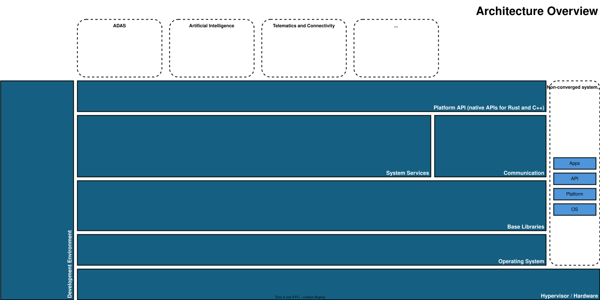

..
   # *******************************************************************************
   # Copyright (c) 2026 Contributors to the Eclipse Foundation
   #
   # See the NOTICE file(s) distributed with this work for additional
   # information regarding copyright ownership.
   #
   # This program and the accompanying materials are made available under the
   # terms of the Apache License Version 2.0 which is available at
   # https://www.apache.org/licenses/LICENSE-2.0
   #
   # SPDX-License-Identifier: Apache-2.0
   # *******************************************************************************

.. _architecture_introduction:

Architecture Introduction
=========================

.. document:: Architecture introduction
   :id: doc__architecture_introduction
   :status: valid
   :version: 1
   :safety: QM
   :security: NO
   :realizes: wp__training_path[version==1]

.. note::
   Have a look on the current :ref:`Platform Architektur <platform_architecture>`.

.. note::
   The corresponding Architectural Elements are described in :need:`Building Block Concept <doc_concept__general_building_blocks>`.

Eclipse S-CORE has a `Software Architecture Community <https://github.com/orgs/eclipse-score/discussions/categories/architecture-community>`_
**responsible for maintaining and evolving the architecture**.

Structural changes and new functionality are proposed through a **Feature and Enhancement Proposal (FEP)** .
All past **Feature Requests** are documented in the corresponding
`Feature Requests / Modification <https://github.com/orgs/eclipse-score/projects/4/views/1>`_ GitHub project.

**Submitting a FEP** is described in the :ref:`Feature & Enhancement Proposal Guideline <feature_request_guideline>`.
Participation in the architecture process is encouraged.

The **software architecture community regularly organizes workshops** where contributors can:

- present new ideas
- discuss **approved new feature requests**, and
- evaluate whether **existing solutions** from other projects can be adopted.

These workshops are open for participation both online and onsite.
