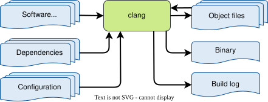
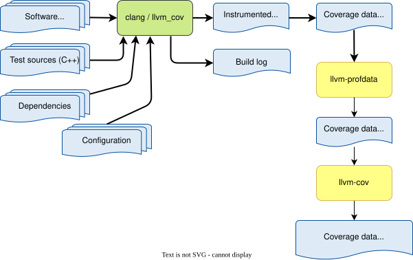

..
   # *******************************************************************************
   # Copyright (c) 2026 Contributors to the Eclipse Foundation
   #
   # See the NOTICE file(s) distributed with this work for additional
   # information regarding copyright ownership.
   #
   # This program and the accompanying materials are made available under the
   # terms of the Apache License Version 2.0 which is available at
   # https://www.apache.org/licenses/LICENSE-2.0
   #
   # SPDX-License-Identifier: Apache-2.0
   # *******************************************************************************

.. doc_tool:: clang
   :id: doc_tool__clang
   :status: draft
   :version: 1
   :tool_version: 19.x
   :tcl: HIGH
   :safety_affected: YES
   :security_affected: NO
   :realizes: wp__tool_verification_report[version==1]
   :tags: tool_management, tools_compiler

Clang Compiler Verification Report
==================================

Introduction
------------
Scope and purpose
~~~~~~~~~~~~~~~~~
Clang is the C/C++ compiler front end of the LLVM toolchain.

In the context of the S-CORE project, clang is used on the Linux host for
verification activities that require LLVM source-based instrumentation.
The associated LLVM coverage tooling (``llvm-profdata`` and ``llvm-cov``) is
used together with clang-generated instrumentation for structural coverage
evidence generation and reporting.
For traceability in S-CORE naming, this report explicitly refers to
``llvm_cov`` (llvm-cov) and ``llvm_cov_profdata`` (combined llvm-profdata/
llvm-cov workflow).

This report covers the Linux host verification workflow only. It does not
cover production-target compilation with clang, Rust compiler qualification,
or QNX-specific coverage flows.

Inputs and outputs
~~~~~~~~~~~~~~~~~~
| Inputs: Software sources (C++), compiler options, build configuration, profile runtime output (``*.profraw``)
| Outputs: Object files, host test binaries, instrumentation metadata, merged profile data (``*.profdata``), coverage reports

  clang overview

Available information
~~~~~~~~~~~~~~~~~~~~~
- Version: 19.x [1]_
- Official documentation: https://clang.llvm.org/docs/
- Official documentation llvm-cov: https://llvm.org/docs/CommandGuide/llvm-cov.html
- Official documentation llvm-profdata: https://llvm.org/docs/CommandGuide/llvm-profdata.html

Installation and integration
----------------------------
Installation
~~~~~~~~~~~~
clang is provided via the LLVM host toolchain used by the project.

Integration
~~~~~~~~~~~
clang is selected in dedicated host build configurations used for coverage
instrumentation and related verification workflows.

Coverage is generated as part of the host verification workflow:

#. Build and execute instrumented unit tests.
#. Merge raw profiles with llvm-profdata.
#. Generate coverage reports with llvm-cov.

The qualification boundary is explicitly limited to this workflow:

* clang adds instrumentation during host builds through LLVM source-based
  coverage options.
* ``llvm-profdata`` merges ``*.profraw`` execution data into ``*.profdata``.
* ``llvm-cov`` converts the instrumented binaries and merged profile data into
  developer-facing coverage reports.

The resulting coverage report is a development artifact used by human
reviewers in verification activities. Instrumented binaries are executed only
during test runs and are not deployed as production software artifacts.

Environment
~~~~~~~~~~~
Requires Linux host environment and Bazel toolchain integration.

Safety evaluation
-----------------
This section outlines the safety evaluation of clang for its use within the
S-CORE project.

.. list-table:: clang safety evaluation
   :header-rows: 1
   :widths: 1 2 8 2 6 4 2 2

   * - Malfunction identification
     - Use case description
     - Malfunctions
     - Impact on safety?
     - Impact safety measures available?
     - Impact safety detection sufficient?
     - Further additional safety measure required?
     - Confidence (automatic calculation)
   * - 1
     - Host compilation for coverage-enabled tests
     - | Semantically wrong host test binary
       | Could distort verification conclusions.
     - yes
     - yes
     - yes
     - no
     - high
   * - 2
     - Coverage reporting
     - | Coverage data too high
       | Reported coverage is higher than actual, masking untested code.
     - yes
     - yes
     - yes
     - no
     - high
   * - 3
     - Coverage reporting
     - | Coverage data too low
       | Reported coverage is lower than actual, causing unnecessary rework.
     - no
     - yes
     - yes
     - no
     - high
   * - 4
     - Profile merge/report generation
     - | Incomplete profile merge or incorrect report filtering
       | Can distort coverage results.
     - yes
     - yes
     - yes
     - no
     - high

Security evaluation
-------------------
This section outlines the security evaluation of clang for its use within the
S-CORE project.

.. list-table:: clang security evaluation
   :header-rows: 1

   * - Threat identification
     - Use case description
     - Threats
     - Impact on security?
     - Impact security measures available?
     - Impact security detection sufficient?
     - Further additional security measure required?
   * - 1
     - TBD
     - TBD
     - TBD
     - TBD
     - TBD
     - TBD

Confidence measures
-------------------
To increase confidence in the clang/``llvm_cov``/``llvm_cov_profdata`` coverage
workflow, the following measures are applied or recommended for the S-CORE
verification environment:

* Treat the coverage workflow as a separate verification path from production
  builds so that instrumentation-related effects stay confined to host test
  execution.
* Provide a small validation suite with dedicated C++ source files whose
  expected structural coverage is known in advance.
* Cover representative language constructs such as straight-line code,
  conditional branches, loops, switch statements, short-circuit conditions,
  templates and excluded regions.
* Provide unit tests for these validation sources so that specific coverage
  outcomes are exercised intentionally, for example full coverage, partial
  branch coverage and deliberately uncovered code.
* Execute the validation suite in CI with LLVM instrumentation enabled and
  compare the produced ``*.profraw``/``*.profdata`` data and final
  ``llvm-cov`` report against expected results.
* Include at least one intentionally uncovered file or line in the validation
  suite so that false-positive reporting is easier to detect during review and
  CI execution.
* Re-run the coverage workflow from a clean build in CI so that profile merge
  failures, missing reports and threshold regressions are visible as build
  failures rather than silent degradations.
* Use a secondary plausibility cross-check that compares the expected coverage
  baseline (for example number of source files and rough line-count totals in the project)
  against the files and aggregates reported by ``llvm-cov``.
* Compare known-covered and known-uncovered lines in the generated report as a
  targeted spot check when the LLVM version or reporting flow changes.
* Re-run the validation suite whenever the LLVM/clang toolchain version changes
  or the coverage workflow is modified.
* Keep the validation sources and expected results version-controlled so that
  tool behavior is reproducible and regressions become reviewable.

The dedicated validation suite with intentionally designed reference cases is
the primary confidence measure. The file/line-count comparison is a secondary
sanity check that can reveal missing files, empty profiles or implausible report
totals, but it does not by itself prove correct branch/region attribution.

For the LLVM coverage workflow, the relevant error-detection mechanisms are
independent review of selected report lines, CI re-execution from scratch,
threshold-based gating and validation cases with known expected outcomes.
These measures are intended to detect both optimistic and pessimistic coverage
misreporting before the results are used in a safety argument.

Result
------
clang is used in host verification workflows and is currently evaluated with
confidence level HIGH for this use case.
The associated llvm-profdata/llvm-cov coverage tooling is covered by this
verification context.
This includes ``llvm_cov`` and ``llvm_cov_profdata``.

Within this scope, ``llvm-profdata`` and ``llvm-cov`` are treated as
development tools whose output is a verification report for human assessment.
Incorrectly low coverage remains a conservative failure mode. Incorrectly high
coverage is the relevant safety concern, and the confidence measures above are
the basis for keeping this workflow in the project-internal high-confidence
category for Linux host verification use. On that basis, this report does not
identify an additional formal qualification action for the current Linux host
coverage-reporting scope.

.. [1] The tool version mentioned in this document is preliminary. It is subject to
       change and will be updated in future.
